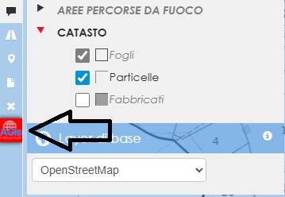

# BOTTONE PERSONALIZZATO NEL DOCK
Questi due script permettono di aggiungere un bottone   
personalizzato nel Dock attingendo   
da una immagine nella cartella media.   
Lo script JS va salvato nella cartella JS della repository;   
Lo script CSS va incollato alla fine del file map.css.

## VERSIONE TESTATA IN LIZ 3.9
Versione stabile con Liz 3.9 (20.01.2026)
Rev1 - Refactoring completo per rendere lo script più robusto, modulare e sicuro   
Nessuna modifica funzionale

## ANTEPRIMA

