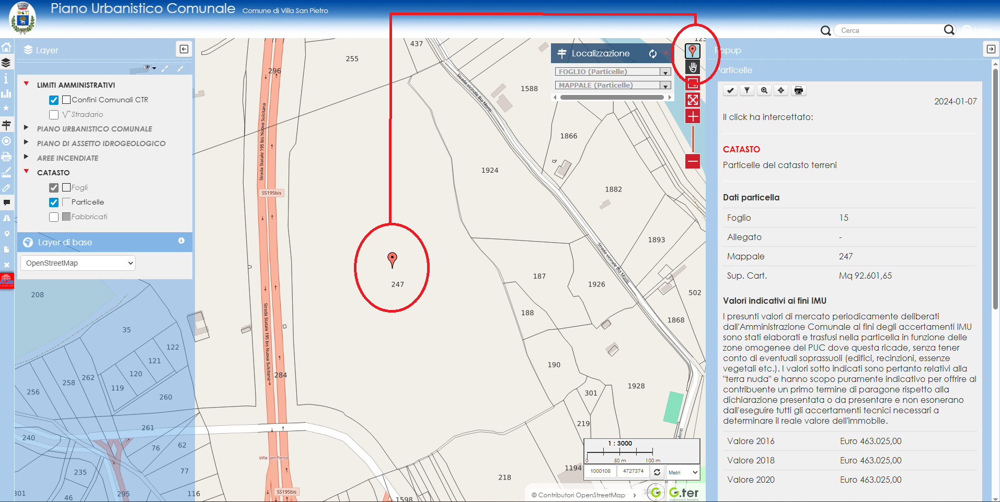

# SEGNAPOSTO
Questo Tool permette di materializzare un segnaposto nell'ultima posizione
cliccata

## V01 - VERSIONE PER LIZ 3.8 e 3.9
Versione usata e stabile fino al 18.01.2026 con Liz 3.8   
Funzionante anche in Liz 3.9 (19.01.2026)   
Rev1 - Refactoring completo per rendere lo script più robusto, modulare e sicuro   
Nessuna modifica funzionale
Maggio 2026
Prossiva modifica in programma per incrementare ancora la sicurezza:   
- Sostituire l'icona servita da google con una icona personalizzata servita dal server Gter.

## ANTEPRIMA

