# WORKFLOW QGIS -> QGIS SERVER -> LIZMAP CON VETTORI GEOPACKAGE
Sistema Informativo Territoriale Comune di Villa San Pietro

 

Hosting: Servizio Gishosting di Gter (Genova)   
Formato vettoriale: Geopackage   
Anno di messa in esercizio: 2023

## INTRODUZIONE
Il workflow presentato in questo documento non è un esercizio teorico, ma il risultato di un lavoro concreto sviluppato e applicato nel Sistema Informativo Territoriale del Comune di Villa San Pietro.   

Le mappe prodotte con questa metodologia sono pubblicate stabilmente attraverso l’infrastruttura di Gter (servizio GisHosting – Piano Base) e vengono utilizzate quotidianamente sia dagli uffici tecnici sia dai cittadini.   

L’esperienza maturata sul campo ha permesso di affinare progressivamente ogni fase del processo, rendendo il sistema affidabile, scalabile e facilmente aggiornabile. Il workflow nasce dall’esigenza di costruire una struttura robusta, coerente e replicabile, capace di supportare efficacemente la gestione dei dati territoriali e la produzione del Certificato di Destinazione Urbanistica.   

Il sistema è stato progettato per rendere accessibile anche ai piccoli comuni, con risorse economiche e infrastrutturali limitate, l’adozione di tecnologie WebGIS per la costruzione e pubblicazione del proprio Sistema Informativo Territoriale.   

Il risultato ottenuto è pubblicato stabilmente al seguente link:   

<a href="https://map.gishosting.eu/index.php/view/map?repository=comunevillasanpietro&project=A03CPianoUrbanisticoComunale" target="_blank"
   style="display:inline-block; padding:10px 15px; background:#2c7be5; color:white; border-radius:6px; text-decoration:none;">
 🌍 Piano urbanistico comunale Comune di Villa San Pietro
</a>

---

## PREPARAZIONE DEI DATI

### Curare le prestazioni
La mappa pubblicata in Lizmap adotta il sistema di riferimento della mappa di base (OpenStreetMap o altri servizi), cioè EPSG:3857 – WGS84/Pseudo Mercator. QGIS Server riproietta automaticamente tutti i layer verso questo sistema di riferimento.
Per ridurre il carico computazionale sul server, soprattutto in presenza di molti layer, e per evitare disallineamenti dovuti a riproiezioni dinamiche, è consigliabile che i dati vettoriali e le eventuali altre mappe di base siano già disponibili in EPSG:3857.
Tuttavia, EPSG:3857 non è un sistema adatto all’editing né ai calcoli spaziali, poiché non garantisce coerenza geometrica e metrica. Per tutte le attività tecniche, analitiche e certificative è necessario utilizzare un sistema di riferimento proiettato idoneo.
In Sardegna è possibile utilizzare EPSG:3003 (Roma40 / Monte Mario) oppure EPSG:7791 (ETRF2000 / RDN2008). La mappa deve essere costruita e mantenuta in uno di questi sistemi, e successivamente i layer devono essere riproiettati in EPSG:3857 per la pubblicazione.
È quindi opportuno mantenere due dataset sincronizzati: – uno “master” in EPSG:3003 o EPSG:7791 – uno “di pubblicazione” in EPSG:3857
Le conversioni 3003 <-> 3857 e 7791 <-> 3857 sono standard e non presentano criticità.
La conversione 3003 <-> 7791, invece, non è standard e richiede l’uso dei grigliati IGM per garantire precisione metrica. In assenza dei grigliati è necessario evitare questa trasformazione, poiché comporta errori dell’ordine di diversi metri.

### Layer catastali
L’Agenzia delle Entrate mette a disposizione dei professionisti, tramite accesso con credenziali CIE/SPID/CNS, la fornitura dei dati catastali vettoriali comunali in diversi formati e sistemi di riferimento.
L’utilizzo dei dati è regolato dalla licenza Creative Commons CC BY 4.0, che consente il riuso anche commerciale con obbligo di attribuzione.
Per le attività tecniche e cartografiche è particolarmente indicato il formato GeoJSON, poiché può essere utilizzato direttamente in QGIS senza plugin aggiuntivi ed è disponibile sia in EPSG:3003 sia in EPSG:7791, entrambi idonei all’esecuzione di calcoli metrici e analisi spaziali.
La fornitura GeoJSON contiene tutti gli strati catastali; per ottenere un buon equilibrio tra prestazioni, leggibilità e completezza del dato è consigliabile estrarre e utilizzare principalmente gli strati dei Fogli e delle Particelle, che costituiscono la base delle analisi urbanistiche e delle certificazioni.

#### Normalizzazione della fornitura catastale e struttura dei layer
Per garantire la robustezza delle automazioni e favorire la replicabilità dei processi è necessario stabilire una struttura predefinita della tabella degli attributi. La fornitura dei dati catastali ottenuta dal portale dell’Agenzia delle Entrate può presentare variazioni nella struttura dei campi tra un aggiornamento e l’altro; per questo motivo, anche se la normalizzazione potrebbe essere automatizzata, si suggerisce di eseguirla manualmente, così da mantenere pieno controllo sia sulla struttura originale sia su quella finale.
Una volta verificata e normalizzata la fornitura, si consiglia di adottare le seguenti strutture standardizzate.   
 
Layer Fogli
- fid — integer, chiave primaria interna.
- COMUNE — text, nome del Comune.
- FOGLIO — integer, numero del foglio catastale.
- COD_CAT — text, codice catastale del Comune.
 

Layer Particelle
- fid — integer, chiave primaria interna.
- FOGLIO — integer, numero del foglio catastale.
- ALLEGATO — text, indicativo dell’allegato.
- MAPPALE — text, numero della particella (può contenere lettere).
- SUPCALC — real, area della particella utilizzata per i calcoli metrici.
- SUPVIDEO — text, area formattata per la visualizzazione (migliaia + due decimali).
- VIRTID — text, identificativo univoco della particella ottenuto concatenando: LPAD(FOGLIO, 5, '0') || LPAD(MAPPALE, 15, '0') Questo garantisce un codice univoco, ordinabile e privo di ambiguità (es. distingue correttamente 1/11 da 11/1).
- id — integer, numero progressivo generato con row_number() utile per verifiche interne e per controllare la corrispondenza con fid.
- layer — text, campo derivato dalla fornitura per verificare che siano state estratte solo le particelle.
- anno — text, anno della fornitura catastale.
- agg — text, data di aggiornamento della fornitura.
 

#### Perché non automatizzare la normalizzazione
Le forniture catastali dell’Agenzia delle Entrate non sono completamente uniformi nel tempo: possono variare nella denominazione dei campi, nella presenza di attributi aggiuntivi o nella struttura interna dei layer. Automatizzare la normalizzazione significherebbe assumere che la struttura sia sempre identica, con il rischio di introdurre errori silenziosi difficili da individuare.
L’esecuzione manuale della normalizzazione consente invece di verificare ogni volta la coerenza della fornitura, garantendo che i dati siano correttamente allineati alla struttura standard adottata dal progetto.

### Layer Tematici
I layer tematici rappresentano gli strati informativi che descrivono il territorio e che si sovrappongono alla cartografia catastale e alle mappe di base. Possono essere numerosi e molto eterogenei tra loro; per questo motivo è opportuno organizzarli in una struttura logica e gerarchica che ne faciliti la gestione, la lettura e l’utilizzo nelle automazioni.
Si suggerisce di suddividere i layer in temi principali, identificati da un codice numerico progressivo, e in sotto temi, anch’essi codificati in modo coerente.   
Esempio di organizzazione dei temi:
- T01 – Piano urbanistico Comunale;
- T02 – Piano di assetto idrogeologico;
- ...
 

Esempio di organizzazione dei sotto temi:   
T01 – Piano urbanistico comunale
- T01.01 - Zonizzazione;
- T01.02 – Variante strada;
- T01.03 – Variante localizzazione ospedale;
- T01.04 - ...

T02 – Piano di assetto idrogeologico
- T02.01 – Pericolosità idraulica;
- T02.02 – Pericolosità geologica;
- ...
 

La codifica dei temi non deve essere casuale, ma definita in base all’ordine con cui si desidera che i layer compaiano nella tabella del Certificato di Destinazione Urbanistica.
In questo modo, ad esempio, il Piano Urbanistico Comunale (T01) verrà riportato per primo, seguito dalle sue varianti (T01.xx), e successivamente dalle informazioni relative alla pericolosità idraulica e geologica (T02.xx).   
Questa struttura garantisce:
- coerenza tra progetto QGIS, Lizmap e CDU;
- ordinamento stabile e prevedibile;
- facilità di manutenzione nel tempo;
- maggiore leggibilità per tecnici e cittadini;
- automazioni più robuste e meno soggette a errori.

#### Normalizzazione dei layer tematici e loro struttura
Per facilitare e velocizzare le automazioni, le intersezioni vettoriali e la produzione del Certificato di Destinazione Urbanistica, è consigliabile normalizzare i layer tematici adottando una struttura uniforme e stabile nel tempo.
La normalizzazione deve tenere conto dei contenuti della pubblicazione che si intende realizzare e deve garantire che ogni layer tematico disponga degli attributi necessari per essere correttamente interpretato dal sistema.
Una struttura particolarmente solida e flessibile è la seguente:
- fid: integer – chiave primaria;
- CODTEMA: text – contiene il codice tema (esempio T01.01);
- DESCTEMA: text – contiene la descrizione del tema (esempio PIANO URBANISTICO);
- TEMA: text – contiene per esteso “CODTEMA”||’ ‘||”DESCTEMA” (esempio T01.01 PIANO URBANISTICO);
- ZONA: text – contiene l’etichetta della zona rappresentata dalla geometria (esempio A o B o C);
- DETTAGLIO: text – contiene la descrizione della zona (esempio CENTRO STORICO o COMPLETAMENTO);
- NORME: text – contiene i riferimenti normativi (esempio Artt. da 32 a 44 delle NTA del PUC);
- IMGZONA: text – contiene l’URL ad una immagine sulla cartella media che caratterizza la zona;
- DESCRIZ_A: text – contiene una descrizione più estesa e completa della zona;
- DESCRIZ_B: text – contiene una seconda descrizione più estesa della zona per ulteriori approfondimenti;
- DESCRIZ_C: text – contiene una terza descrizione se necessaria;
- LINK_A: text – contiene l’URL a un documento o risorsa esterna;
- DESLINK_A: text – contiene la descrizione dell’URL A (es: Vedi NTA del PUC);
- LINK_B: text – contiene l’URL a un documento o risorsa esterna;
- DESLINK_B: text – contiene la descrizione dell’URL B (es: Vedi NTA del PAI);
- LINK_C: text – contiene l’URL a un documento o risorsa esterna;
- DESLINK_C: text – contiene la descrizione dell’URL C (es: Vai a sito regionale);
- LINK_D: text – contiene l’URL a un documento o risorsa esterna;
- DESLINK_D: text – contiene la descrizione dell’URL D (es: Vedi documento);
- LINK_E: text – contiene l’URL a un documento o risorsa esterna;
- DESLINK_E: text – contiene la descrizione dell’URL E (es: Scarica file);
- LINK_F: text – contiene l’URL a un documento o risorsa esterna;
- DESLINK_F: text – contiene la descrizione dell’URL F (es: Approfondimento);
- LINK_G: text – contiene l’URL a un documento o risorsa esterna;
- DESLINK_G: text – contiene la descrizione dell’URL G (es: Vai al Piano Particolareggiato).

 
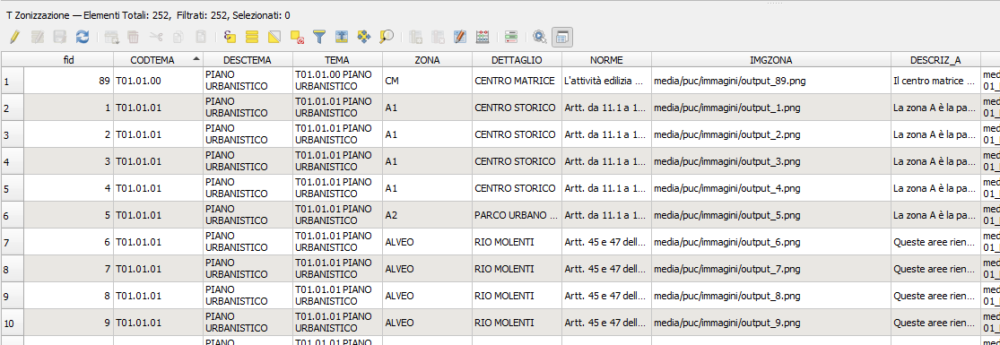
 

#### Campi obbligatori e campi opzionali
- Obbligatori: CODTEMA, DESCTEMA, TEMA, ZONA, DETTAGLIO, NORME → senza questi campi, il CDU risulterà incompleto o vuoto nelle parti essenziali.
- Opzionali: tutti i campi successivi a NORME → Lizmap li ignora se vuoti, quindi possono essere popolati solo quando necessari.
Questa scelta rende la struttura estremamente flessibile: puoi avere layer molto semplici (solo i campi essenziali) o layer molto ricchi (descrizioni, immagini, link, approfondimenti).

#### Perchè questa struttura
- Uniforma tutti i layer tematici, anche se provengono da fonti diverse.
- Stabilizza le automazioni (intersezioni, merge, CDU).
- Riduce gli errori dovuti a campi mancanti o denominazioni incoerenti.
- Permette aggiornamenti periodici senza dover riscrivere script o modelli.
- Supporta Lizmap in modo nativo (popup, media, immagini, link, descrizioni).
- Rende il CDU leggibile e completo, con testi e riferimenti normativi.

### Analisi urbanistica: intersezione tra particelle e layer tematici
Una volta predisposti i layer catastali e i layer tematici normalizzati, è possibile eseguire l’analisi urbanistica mediante l’intersezione tra le particelle e i layer tematici, calcolando per ciascuna particella le percentuali di sovrapposizione e preservando tutte le informazioni provenienti dai diversi temi.
Esistono diverse strategie per eseguire questa analisi. La più diffusa consiste nel reiterare l’intersezione tra le particelle e ciascun layer tematico, producendo tanti risultati quante sono le sorgenti informative. Tuttavia, la normalizzazione eseguita sui layer tematici non è stata introdotta solo per uniformare la struttura dei dati, ma anche per rendere più efficiente l’intero processo di analisi.
Poiché tutti i layer tematici condividono la stessa struttura, è possibile eseguire un merge tra essi, ottenendo un unico layer tematico che contiene al suo interno tutte le zone rilevanti ai fini dell’analisi urbanistica, con una struttura perfettamente coerente con quella di ciascun layer di origine.
In questo modo, anziché eseguire tante intersezioni quante sono le sorgenti tematiche, è sufficiente eseguire una sola intersezione tra le particelle catastali e il layer tematico unificato.
Questa strategia comporta un vantaggio significativo in termini di prestazioni, velocità e stabilità del processo, soprattutto in presenza di numerosi layer tematici o di geometrie complesse.
L’intero procedimento può essere automatizzato tramite uno script Python, sviluppato con l’assistenza dell’Intelligenza Artificiale, che consente di selezionare i layer tematici da includere nel merge e di eseguire automaticamente l’intersezione con le particelle, scrivendo i risultati in un layer appositamente predisposto.
Il layer di destinazione, se si segue lo schema dei layer catastali e tematici fin qui descritto, deve avere la seguente struttura:
- fid — integer, chiave primaria intern;
- FOGLIO — integer, deriva dal layer particelle;
- ALLEGATO — text, deriva dal layer particelle;
- MAPPALE — text, deriva dal layer particelle;
- TEMA: text – deriva dal layer tematico;
- ZONA: text – deriva dal layer tematico;
- DETTAGLIO: text – deriva dal layer tematico;
- NORME: text – deriva dal layer tematico;
- PERCENT: integer - percentuale calcolata dall’algoritrmo;
- PERCENT_V: text – percentuale da visualizzare calcolata dall’algoritmo che gestisce le percentuali pari a zero;
- IMGZONA: text – deriva dal layer tematico;
- DESCRIZ_A: text – deriva dal layer tematico;
- DESCRIZ_B: text – deriva dal layer tematico;
- DESCRIZ_C: text – deriva dal layer tematico;
- LINK_A: text – deriva dal layer tematico;
- DESLINK_A: text – deriva dal layer tematico;
- LINK_B: text – deriva dal layer tematico;
- DESLINK_B: text – deriva dal layer tematico;
- LINK_C: text – deriva dal layer tematico;
- DESLINK_C: text – deriva dal layer tematico;
- LINK_D: text – deriva dal layer tematico;
- DESLINK_D: text – deriva dal layer tematico;
- LINK_E: text – deriva dal layer tematico;
- DESLINK_E: text – deriva dal layer tematico;
- LINK_F: text – deriva dal layer tematico;
- DESLINK_F: text – deriva dal layer tematico;
- LINK_G: text – deriva dal layer tematico;
- DESLINK_G: text – deriva dal layer tematico;
- ORD: text – campo libero da popolare successivamente sulla base dell’ordinamento che si intende ottenere;
- FK_CAT: integer – preservato dall’algoritmo che associa ad ogni intersezione la chiave primaria della particella;
- VIRTID: text – derivata dal layer particelle.

#### Ordinamento della tabella analisi urbanistica
Per ottenere un ordinamento stabile e coerente dei risultati dell’analisi urbanistica è necessario definire l’ordinamento   
 
“TEMA”||”ZONA”||”DETTAGLIO”||Lpad(“PERCENT”, ‘0’,3)   
 
Questa concatenazione garantisce un ordinamento logico e prevedibile tra temi, sotto‑temi, zone e percentuali di sovrapposizione, assicurando che la tabella finale rispetti la gerarchia definita nella codifica dei layer tematici.
Il campo ORD riveste un ruolo fondamentale perché deve essere utilizzato per costruire i valori del campo fid del GeoPackage prima della scrittura finale. Lizmap, infatti, ordina i “figli” sulla base del loro fid in ordine decrescente; pertanto, se si mantengono i fid generati automaticamente dall’algoritmo, non vi è alcuna garanzia che i risultati vengano visualizzati nell’ordine desiderato.
Una volta definito l’ordinamento corretto tramite il campo ORD, è necessario procedere alla rigenerazione dei fid secondo tale ordine.   
La procedura consigliata è la seguente:
- ordinare la tabella dell’analisi urbanistica in base al campo ORD (in cima il tema che si vuole visualizzare per ultimo);
- copiare e incollare tutti i record in un layer temporaneo;
- applicare al campo fid la funzione row_number() per generare una numerazione progressiva coerente con l’ordinamento desiderato;
- utilizzare il layer temporaneo per sovrascrivere il layer dell’analisi urbanistica nel GeoPackage (se già esistente) oppure per crearlo ex novo se si tratta della prima generazione.

Questa procedura garantisce che Lizmap visualizzi i risultati dell’analisi urbanistica nell’ordine corretto, rispettando la gerarchia dei temi e la struttura del Certificato di Destinazione Urbanistica.

#### Automazione delle intersezioni
Lo script Python è progettato come azione associata al layer delle particelle, in modo da ridurre al minimo la possibilità di errore da parte dell’operatore.   
Lo script:
- individua automaticamente il layer delle particelle, evitando selezioni errate;
- permette di selezionare il layer predisposto per accogliere l’analisi urbanistica e mantiene in memoria tale scelta per le esecuzioni successive;
- consente di selezionare i layer tematici da includere nell’intersezione e ricorda anche questa selezione;
- per dataset molto estesi, supporta la modalità incrementale, elaborando blocchi consecutivi di particelle e salvando progressivamente i risultati nella stessa tabella, senza sovrascrivere i dati già presenti.

Questa modalità incrementale è particolarmente utile quando si lavora con:
- migliaia di particelle selezionate;
- layer tematici complessi;
- server o workstation con risorse limitate.

In questo modo l’analisi rimane robusta, scalabile e ripetibile, senza rischiare blocchi o perdita di dati.

#### Perché non automatizzare l’ordinamento
L’ordinamento finale dell’analisi urbanistica è un’operazione:
- semplice;
- veloce;
- soggetta a possibili variazioni a ogni aggiornamento dei dati.
- 
Automatizzarlo all’interno dello script significherebbe:
- irrigidire il processo;
- dover modificare lo script ogni volta che cambia una regola di ordinamento;
- introdurre potenziali fragilità in un componente che deve rimanere stabile.

Mantenendo l’ordinamento come fase manuale, si ottengono due vantaggi fondamentali:
- Lo script rimane sempre coerente e robusto, perché lavora solo su dati stabili e consolidati.
- L’operatore mantiene il controllo su eventuali modifiche da apportare all’ordinamento in occasione di aggiornamenti, varianti o nuove esigenze di pubblicazione.

In altre parole lo script automatizza ciò che deve essere stabile, mentre l’ordinamento rimane flessibile e sotto controllo umano.

### Organizzazione dei dati in GeoPackage tematici
Per garantire la scalabilità del sistema e facilitare gli aggiornamenti periodici, è consigliabile suddividere i dati in GeoPackage tematici, anziché concentrare tutti i layer in un unico file. Questa scelta presenta numerosi vantaggi operativi:
- aggiornamenti più semplici e mirati: ogni GeoPackage può essere aggiornato indipendentemente dagli altri, senza rischiare di compromettere l’intero dataset;
- riduzione del rischio di corruzione: un file più piccolo e tematicamente coerente è meno soggetto a danneggiamenti e, in caso di problemi, l’impatto è limitato al solo tema interessato;
- maggiore modularità: ogni GeoPackage può essere collegato a più progetti QGIS o a più mappe Lizmap, che si aggiorneranno automaticamente quando il singolo dataset viene sostituito o aggiornato;
- prestazioni migliori: QGIS e Lizmap gestiscono più efficacemente file più piccoli e tematicamente omogenei, riducendo i tempi di caricamento e migliorando la reattività del sistema.

Ad esempio il GeoPackage del Tema 01 del PUC conterrà solamente:
- T01.01.01_Zonizzazione_vigente;
- T01.01.02_Zonizzazione_variante;
- T01.02.01_Variante_OP_Ospedale;
- T01.02.02_Variante_OP_Strada_Centro_Storico.

Il GeoPackage del Tema 02 del PAI conterrà solamente:
- T02.01.01_Reticolo_Idrografico_Vigente;
- T02.01.02_Reticolo_Idrografico_Variante;
- T02.02.01_Pericolosita_Idraulica_Vigente;
- T02.02.02_Pericolosita_Israulica_Variante;
- T02.03.01_Pericolosita_Frana_Vigente;
- T02.03.02_Pericolosita_Frana_variante;
- ...
 

Organizzazione dei Geopackage
 

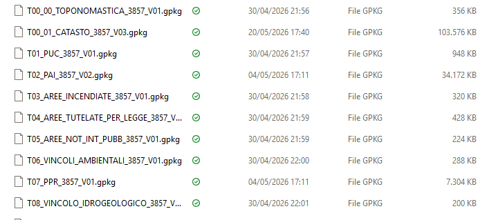
 

Oraganizzazione layer nel Geopackage
 
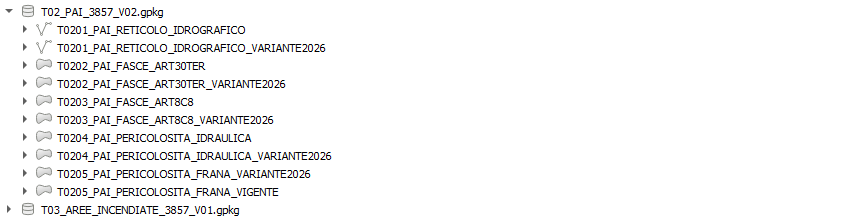
 

## PREDISPOSIZIONE DEL PROGETTO QGIS

### Tematizzazione dei layer
I layer tematici e i layer catastali possono essere tematizzati liberamente: non esistono vincoli particolari, salvo quello di impostare correttamente le trasparenze, che incidono in modo significativo sulla leggibilità della mappa.
Per ragioni di prestazioni è consigliabile attivare in Lizmap l’opzione che consente di eseguire una sola chiamata WMS per tutti i layer visibili, restituendo un’unica immagine composita.
Questa modalità riduce drasticamente il numero di richieste al server, ma impedisce all’utente di modificare manualmente le trasparenze.
Per questo motivo è fondamentale definire tematizzazioni equilibrate, che garantiscano una buona leggibilità senza richiedere interventi da parte dell’utente.

### Raggruppamento dei layer
Quando il progetto contiene numerosi layer, è consigliabile organizzarli in gruppi logici, seguendo la stessa struttura tematica definita per l’analisi urbanistica (T01, T02, …). In Lizmap è opportuno disattivare l’attivazione simultanea dei gruppi, per evitare che l’utente possa accendere accidentalmente decine di layer, generando una chiamata WMS molto pesante e potenzialmente bloccante.

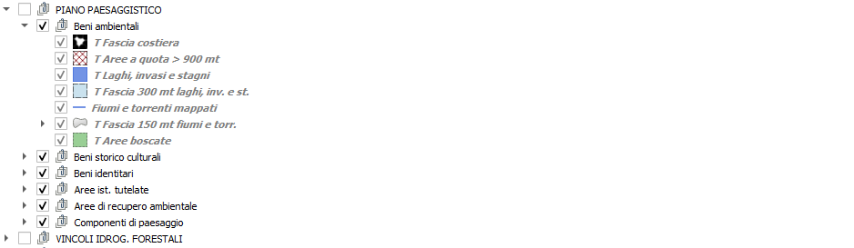
 

### Le viste
In presenza di molti layer tematici, è utile sfruttare le Viste di QGIS, organizzandole secondo gli stessi temi logici dei gruppi. Le viste possono essere rese disponibili in Lizmap e consentono all’utente di attivare rapidamente un intero tema (ad esempio “Piano Urbanistico”, “PAI”, “Vincoli”), senza dover intervenire manualmente sul pannello dei layer.
Questa organizzazione:
- migliora l’esperienza utente;
- riduce il numero di operazioni manuali;
- limita le richieste al server;
- migliora le prestazioni complessive.

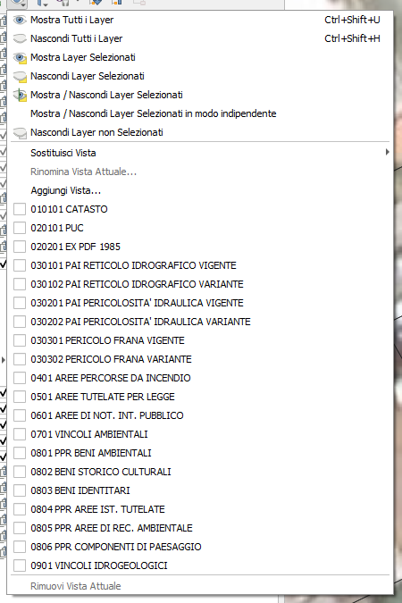
 

### Nome dei layer nel pannello
È consigliabile rinominare i layer nel pannello di QGIS prima della pubblicazione e non modificarli più. QGIS Server e Lizmap utilizzano il nome del layer registrato al momento della pubblicazione per:
- chiamate WMS/WFS;
- popup;
- filtri;
- identificazione dei layer nei layout di stampa.

Se un layer viene rinominato successivamente, Lizmap continuerà a utilizzare il nome originario. Il nome effettivamente pubblicato può essere verificato tramite l’URL WFS mostrato nel pannello “Informazioni del progetto”.
In Lizmap è possibile impostare un alias per la visualizzazione, ma questo alias non viene utilizzato nei layout di stampa, che mostrano sempre il nome del layer definito in QGIS.

### Ordine di visualizzazione
L’ordine di visualizzazione dei layer è determinato dall’ordine nel pannello di QGIS. Questo stesso ordine viene utilizzato anche per la gestione dei popup quando un click intercetta più layer.
È possibile attivare l’ordine di visualizzazione personalizzato, ma tale ordine:
- influisce solo sulla mappa;
- non influisce sui popup.

Per garantire coerenza tra mappa e informazioni restituite, è consigliabile non utilizzare l’ordine personalizzato e mantenere l’ordine naturale del pannello.

### Etichette
Per migliorare le prestazioni è opportuno evitare etichette generate dinamicamente tramite espressioni complesse. È preferibile registrare fisicamente l’etichetta in un campo dedicato.
Si consiglia inoltre di impostare le etichette affinché siano visualizzate solo quando completamente contenute nella geometria, evitando:
- testi sovrapposti;
- etichette illeggibili;
- carico inutile sul server.

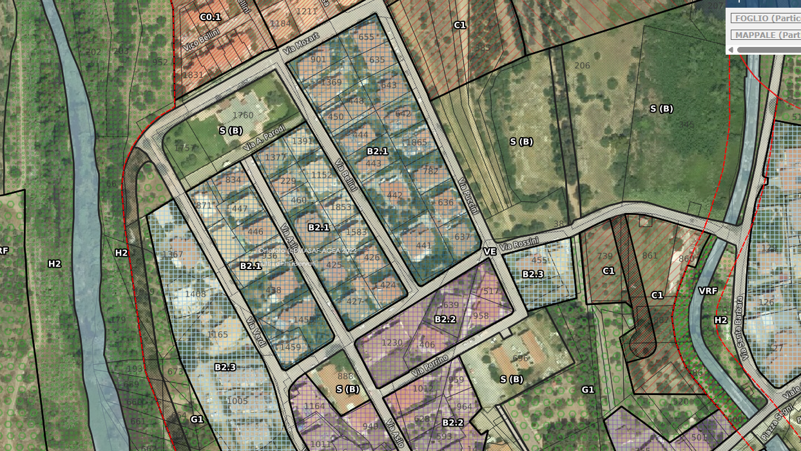
 

### Mappe di base
Le mappe di base sono uno degli elementi più sensibili per le prestazioni complessive. È preferibile utilizzare servizi esterni ad alte prestazioni (OSM, servizi regionali, WMS ottimizzati), anziché pubblicare raster locali non ottimizzati.
In Lizmap è consigliabile attivare l’opzione che permette di ottenere direttamente le mappe dal fornitore esterno, evitando di far transitare inutilmente il flusso attraverso il server QGIS.

### Layout di stampa
Se si desidera offrire all’utente la possibilità di esportare la mappa visualizzata, è necessario predisporre un layout di stampa in QGIS e attivare la funzione di stampa in Lizmap.
Il layout si costruisce normalmente: Lizmap estrarrà automaticamente la mappa corrente e gli elementi necessari al momento della richiesta dell’utente.

Relazione tra Il layer particelle e il layer dell’analisi urbanistica
Nel progetto è necessario impostare una relazione padre-figlio tra il layer particelle e il layer dell’analisi urbanistica. Questa relazione è necessaria per attivare, nel popup delle particelle, la visualizzazione delle destinazioni urbanistiche che riguardano ogni particella.

### Nascondere il layer dell’Analisi urbanistica
Il layer Analisi urbanistica deve essere nascosto sia nel progetto QGIS sia nella configurazione Lizmap. La sua attivazione deve essere limitata esclusivamente al popup informativo, poiché questo layer svolge una funzione di servizio: alimenta le informazioni visualizzate sulle particelle e genera i contenuti necessari al Certificato di Destinazione Urbanistica (CDU).
La visualizzazione diretta sulla mappa non è consigliata per due motivi:
- Esperienza utente - Il layer contiene tutte le intersezioni tra particelle e layer tematici, quindi può raggiungere decine di migliaia di geometrie. La sua rappresentazione grafica sovrapposta agli altri layer renderebbe la mappa poco leggibile e potenzialmente confusiva per l’utente finale.
- Prestazioni - Caricare e disegnare un layer così denso comporta un impatto significativo sulle prestazioni, sia in QGIS Desktop sia in QGIS Server. Nasconderlo garantisce una navigazione fluida e tempi di risposta ottimali, mantenendo comunque disponibili tutte le informazioni tramite popup e servizi WFS.

Per questi motivi, Analisi urbanistica deve essere trattato come un layer tecnico, non destinato alla visualizzazione cartografica ma al supporto funzionale dell’applicazione.

## QGIS SERVER
In QGIS Server è necessario configurare alcuni elementi fondamentali affinché la pubblicazione tramite Lizmap risulti coerente, stabile e performante. Le principali impostazioni da definire sono le seguenti:

### Nome della mappa- nome della mappa
E' il nome che verrà visualizzato nel repository Lizmap. Deve essere chiaro, univoco e non ambiguo, poiché identifica il progetto pubblicato.

### Informazioni sulla mappa.
Nel pannello “Informazioni” è possibile inserire:
- descrizione del progetto,
- riferimenti normativi,
- note tecniche,
- eventuali attribuzioni: queste informazioni saranno visibili agli utenti nel pannello informativo di Lizmap.

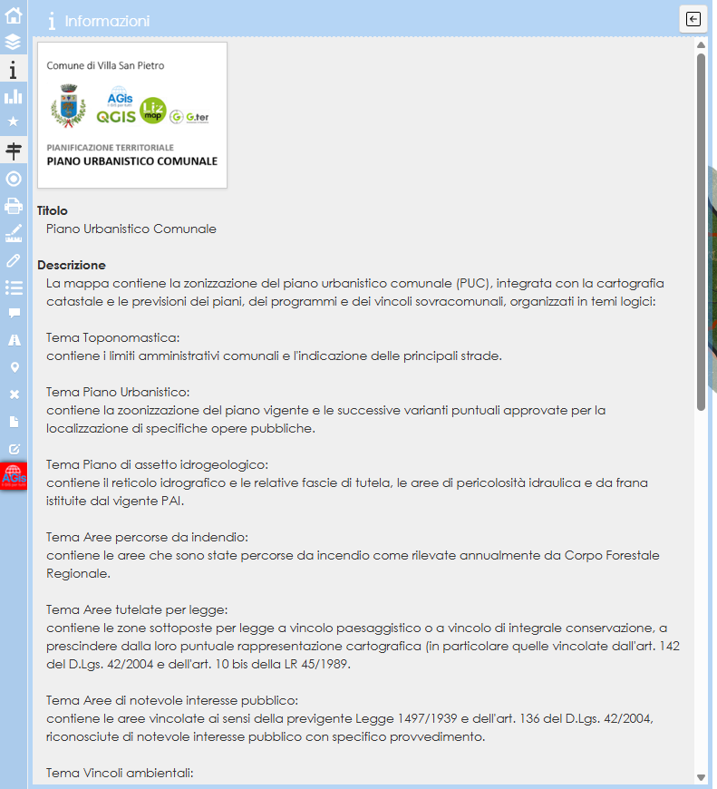
 

### Attribuzioni delle mappe di base
Se si utilizzano servizi esterni (OSM, ortofoto regionali, WMS terzi), è necessario riportare correttamente le attribuzioni richieste dal fornitore, come previsto dalle licenze d’uso.

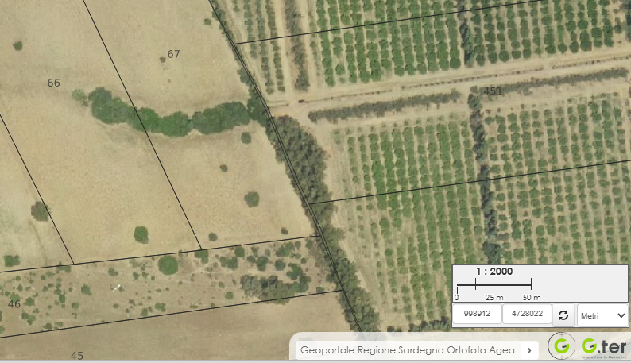
 

### Risposta delle geometrie al click
QGIS Server permette di evidenziare in giallo i contorni della geometria cliccata tramite GetFeatureInfo. Nel workflow descritto questa funzione è disattivata, poiché sostituita da un segnaposto personalizzato in JavaScript, più leggero e più coerente con l’esperienza utente desiderata.

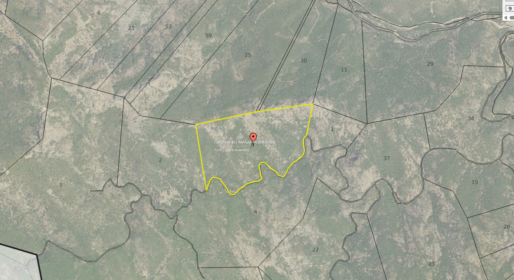
 

### Pubblicazione WFS
E' fondamentale attivare la pubblicazione WFS per tutti i layer che devono supportare:
- selezione;
- pan;
- zoom;
- interrogazione puntuale;
- interazioni avanzate in Lizmap.

In particolare devono essere pubblicati in WFS:
- tutti i layer tematici;
- i layer catastali (Fogli e Particelle);
- il layer dell’analisi urbanistica.

La pubblicazione WFS è indispensabile per consentire a Lizmap di:
- interrogare i layer;
- filtrare le particelle;
- eseguire zoom automatici;
- mostrare popup informativi;
- gestire le relazioni padre figlio.

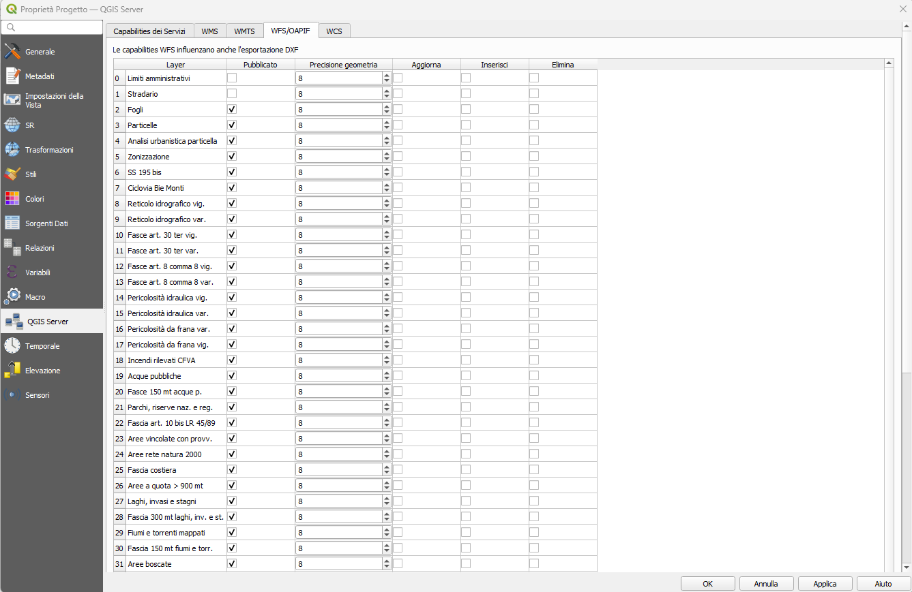
 

## PLUGIN LIZMAP
Attraverso il plugin Lizmap avviene l’impostazione della pubblicazione vera e propria della mappa, vengono definiti i popup, gli strumenti e personalizzati alcuni comportamenti.

### Opzioni generali
Nelle opzioni generali è consigliabile:
- Disabilitare il permalink automatico - Questo evita che un uso eccessivo della funzione generi un numero elevato di richieste al server, con potenziali impatti sulle prestazioni.
- Attivare il caricamento dei layer come singolo WMS.

Questa ultima impostazione permette a QGIS Server di restituire un’unica immagine WMS contenente tutti i layer visibili. Il vantaggio è duplice:
- riduzione del numero di chiamate al server;
- miglioramento della fluidità di navigazione, soprattutto su connessioni lente o dispositivi mobili.

Queste due impostazioni contribuiscono in modo significativo alla stabilità e alla reattività della mappa pubblicata.

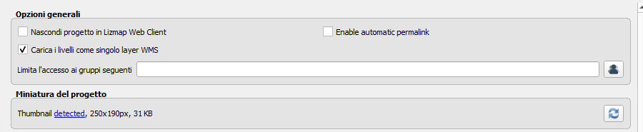
 

### Strumenti mappa
Se si desidera offrire all’utente finale una dotazione completa di strumenti, è possibile attivarli tutti senza controindicazioni.
Gli strumenti Lizmap:
- hanno un impatto trascurabile sulle prestazioni;
- sono ben distribuiti nell’interfaccia;
- non generano confusione, grazie a un layout equilibrato e intuitivo.

Una dotazione completa migliora l’esperienza utente senza appesantire il sistema.

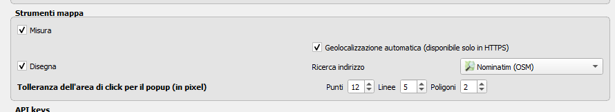
 

### Scale
Per garantire una navigazione coerente e un rendering ottimale, è consigliabile:
- Impostare valori di scala per ogni livello di zoom - Questo permette di controllare la qualità del rendering e di evitare salti troppo bruschi tra una scala e l’altra.
- Definire una scala minima e massima - Serve a impedire che l’utente possa allontanarsi troppo dalla zona di interesse; avvicinarsi oltre il limite utile, ottenendo un ingrandimento eccessivo e poco leggibile.
- Impostare una scala massima adeguata per gli zoom automatici sulle selezioni - Questo evita che, durante la selezione di una particella o di un elemento, la mappa si avvicini troppo rendendo difficile comprendere il contesto territoriale.
- Curare l’estensione iniziale della mappa - L’estensione iniziale è ciò che l’utente vede al primo accesso. Deve essere coerente con lo zoom all’estensione del progetto; adeguata sia per schermi desktop sia per dispositivi mobili.

Una buona configurazione delle scale migliora la leggibilità e riduce il rischio di disorientamento dell’utente.

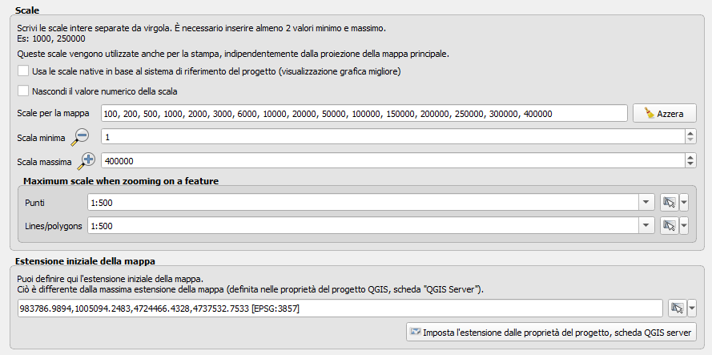
 

### Interfaccia mappa
Le opzioni dell’interfaccia mappa consentono personalizzazioni estetiche e funzionali. Pur lasciando libertà all’editore, si raccomanda:
- di non nascondere strumenti, per mantenere l’interfaccia completa e coerente;
- di fissare a destra la finestra dei popup, così da garantire una dimensione adeguata alla quantità di informazioni da mostrare e un equilibrio visivo con la mappa;
- di mantenere la scala statica nella mappa panoramica, per evitare variazioni inutili e preservare un’interfaccia ordinata.

Queste scelte contribuiscono a un’esperienza utente stabile, pulita e professionale.

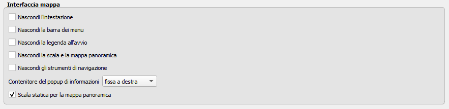
 

### Layer
In questa sezione si definiscono le descrizioni dei gruppi e dei layer, i popup, il comportamento del pannello dei layer e delle mappe di sfondo visualizzate attraverso connessioni esterne.

#### Descrizione dei gruppi e dei layer
Una corretta descrizione dei gruppi e dei layer è fondamentale per garantire trasparenza, manutenibilità e professionalità del progetto cartografico. Ogni elemento pubblicato nella mappa dovrebbe riportare informazioni chiare e sintetiche su:
- cosa rappresenta;
- quale funzione svolge nel sistema informativo;
- da quale fonte proviene il dato;
- con quale frequenza viene aggiornato;
- chi è il referente o l’ente produttore.

Queste informazioni, inserite nelle proprietà del layer e visibili nel pannello informativo di Lizmap, permettono di:
- facilitare la cooperazione tra uffici e tecnici nel tempo;
- rendere immediatamente comprensibile la struttura del progetto anche a chi non lo ha realizzato;
- garantire tracciabilità e affidabilità del dato;
- supportare eventuali audit, verifiche o aggiornamenti futuri;
- migliorare l’esperienza dell’utente finale, che può comprendere l’origine e l’autorevolezza delle informazioni visualizzate.

Una descrizione accurata dei gruppi e dei layer contribuisce a costruire uno strumento cartografico robusto, trasparente e istituzionalmente affidabile, in linea con le buone pratiche dei sistemi informativi territoriali.

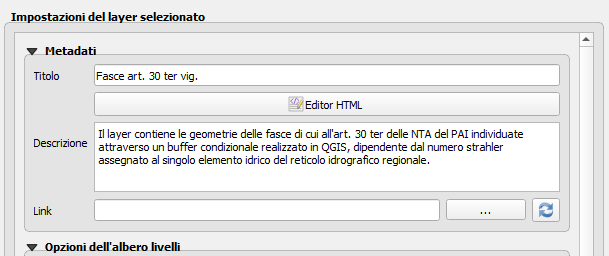
 

### Opzioni dell’albero livelli
Lo strumento di configurazione della visualizzazione permette di definire:
- quali layer devono comparire nel pannello dei layer dell’utente;
- quali layer devono essere attivi all’avvio e quindi visibili sulla mappa al primo caricamento.

È fondamentale configurare questi aspetti con attenzione, poiché influenzano direttamente sia l’esperienza utente sia le prestazioni complessive della mappa.
#### Layer da non visualizzare
Come già evidenziato, il layer Analisi urbanistica non deve essere visualizzato né attivato:
- non deve comparire nel pannello dei layer;
- non deve essere visibile all’avvio;
- non deve essere attivabile dall’utente.

Si tratta infatti di un layer tecnico, destinato esclusivamente a fornire informazioni ai popup e al Certificato di Destinazione Urbanistica. La sua visualizzazione sarebbe inutile, potenzialmente confusiva e penalizzante per le prestazioni.

#### Layer attivi all’avvio
È consigliabile selezionare con cura i layer che devono essere visibili al primo accesso. I criteri principali sono:
- attivare solo i layer indispensabili per iniziare la consultazione;
- ridurre al minimo il carico iniziale, così da garantire un avvio rapido e fluido;
- evitare layer pesanti o con geometrie complesse tra quelli attivi all’apertura.

Un caricamento iniziale leggero migliora sensibilmente la percezione di velocità e la qualità dell’esperienza utente, soprattutto su dispositivi mobili o connessioni non ottimali.

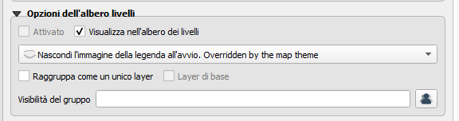
 
 
### Controllare i gruppi
Per preservare le prestazioni e mantenere coerente l’impostazione progettuale, è consigliabile nascondere la casella di controllo dei gruppi nel pannello dei layer. In questo modo l’utente non può attivare o disattivare interi blocchi di layer, evitando configurazioni incoerenti o carichi eccessivi sulla mappa.
Parallelamente, è opportuno attivare automaticamente il primo tema della mappa all’avvio. Questa scelta garantisce:
- un’esperienza utente immediata e guidata;
- un caricamento iniziale leggero e prevedibile;
- una struttura di consultazione ordinata, in cui l’utente parte sempre da un contesto chiaro.

Questa combinazione — gruppi non disattivabili e primo tema attivo — contribuisce a mantenere la mappa stabile, pulita e coerente con il modello informativo definito.

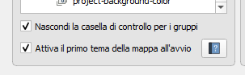
 

### I popup dei layer tematici
I popup rappresentano il principale strumento di restituzione dell’informazione al click dell’utente sulla mappa. Per questo motivo devono essere chiari, gradevoli, intuitivi e coerenti in tutti i layer tematici.
Esistono diverse strategie per la loro costruzione, ma la soluzione più efficace e flessibile è l’utilizzo del QGIS MapTip in HTML, che consente di:
- personalizzare completamente la struttura del popup;
- integrare immagini, icone e pulsanti;
- combinare in modo ordinato le informazioni provenienti dalla tabella attributi;
- garantire un layout stabile e replicabile nel tempo.

Per assicurare affidabilità, prevedibilità e facilità di manutenzione, è consigliabile adottare uno schema di popup predefinito, identico per tutti i layer tematici. Lo schema ideale è suddiviso in sei sezioni verticali, ognuna con una funzione precisa.

Struttura consigliata del popup tematico (6 sezioni)

#### 1. Sezione – Titolo del tema
Contiene la descrizione del tema urbanistico. È alimentata dal campo TEMA, che combina codice e descrizione (es. T01.01 PIANO URBANISTICO). Questa sezione introduce l’utente al contesto normativo dell’area cliccata.

#### 2. Sezione – Immagine rappresentativa
Visualizza un’immagine che rappresenta la zona o l’area di click. L’immagine deve essere:
- ospitata sul server, nella cartella media;
- richiamata tramite l’URL registrato nel campo IMGZONA.

Questa sezione migliora la comprensione visiva e rende il popup più accattivante.

#### 3. Sezione – Zona e titolo
Mostra:
- l’acronimo della zona (ZONA);
- il titolo o la denominazione specifica (DETTAGLIO).

Questa sezione fornisce immediatamente l’informazione urbanistica essenziale.

#### 4. Sezione – Descrizione estesa
Contiene la descrizione completa della zona, alimentata dai campi:
- DESCRIZ_A
- DESCRIZ_B
- DESCRIZ_C

Questi campi permettono di articolare testi lunghi in più blocchi, mantenendo ordine e leggibilità.

#### 5. Sezione – Riferimenti normativi
Riporta i riferimenti normativi che disciplinano l’area, alimentati dal campo NORME. Questa sezione è fondamentale per garantire trasparenza e tracciabilità delle regole applicabili.

#### 6. Sezione – Link alle norme
Contiene i link diretti ai documenti normativi richiamati nella sezione precedente. Sono alimentati dai campi LINK_X (LINK_1, LINK_2, ecc.).
Questa sezione consente all’utente di accedere rapidamente ai testi ufficiali, migliorando l’usabilità e la completezza del popup.

#### Perché adottare uno schema fisso.
Un modello standardizzato garantisce:
- coerenza visiva tra tutti i layer tematici;
- manutenzione semplificata, perché ogni popup segue la stessa logica;
- replicabilità, utile quando si aggiornano o aggiungono nuovi layer;
- affidabilità, evitando comportamenti imprevisti o layout incoerenti;
- professionalità, perché l’utente percepisce un’interfaccia curata e istituzionale.

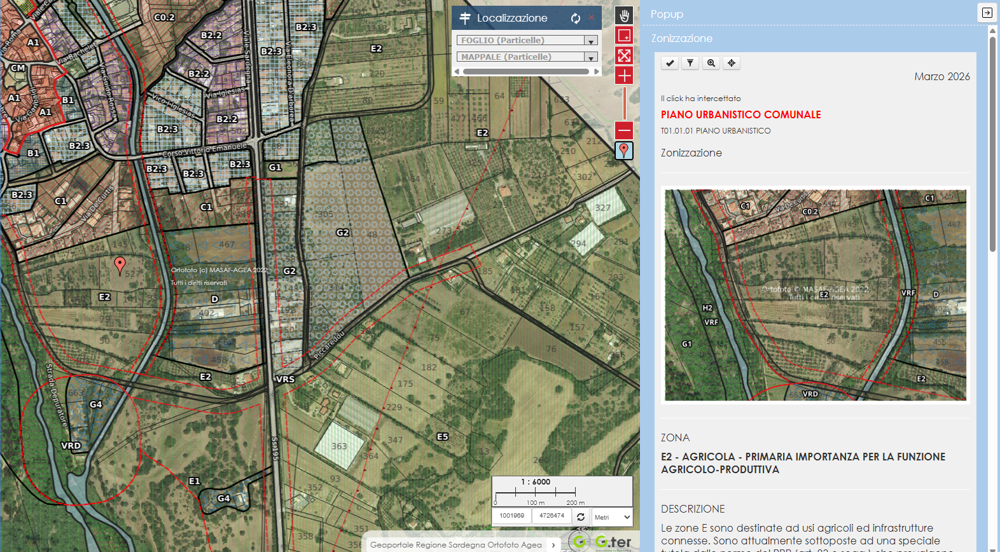
 

### Il popup delle particelle
Il popup delle particelle si distingue da quello dei layer tematici perché la tabella attributi contiene informazioni di natura catastale e non urbanistica. Per garantire chiarezza, coerenza e facilità di consultazione, è consigliabile strutturarlo in tre sezioni verticali, ognuna con una funzione precisa.

#### 1. Sezione – Attribuzione e logo dell’Agenzia delle Entrate
In questa sezione viene visualizzato il logo dell’Agenzia delle Entrate, necessario per rispettare le attribuzioni previste dalla normativa sul dato catastale.
Caratteristiche operative:
- l’immagine è identica per tutte le particelle;
- non è necessario un campo dedicato nella tabella attributi;
- il logo viene richiamato tramite un URL statico, inserito direttamente nel codice HTML del popup;
- l’immagine deve essere archiviata nella cartella media del progetto Lizmap.

Questa sezione assolve alla funzione istituzionale di riconoscimento della fonte del dato.

#### 2. Sezione – Dati catastali della particella
La seconda sezione contiene le informazioni identificative della particella, organizzate preferibilmente in una tabella HTML per garantire ordine e leggibilità.   

I campi da visualizzare sono:
- FOGLIO
- ALLEGATO
- MAPPALE
- SUPCART_V (superficie catastale)

Questa sezione fornisce all’utente tutte le informazioni essenziali per identificare univocamente la particella.

#### 3. Sezione – Accesso all’analisi urbanistica
La terza sezione contiene un testo statico, scritto direttamente nel popup, che spiega come visualizzare l’analisi urbanistica della particella.   

Il testo deve:
- informare l’utente che l’analisi urbanistica è disponibile tramite popup dedicato;
- chiarire che i risultati derivano dall’intersezione tra la particella e i layer tematici presenti sulla mappa;
- guidare l’utente all’azione (es. “cliccare qui per visualizzare l’analisi urbanistica”).

Questa sezione funge da ponte tra il dato catastale e il dato urbanistico, mantenendo separati i due livelli informativi ma collegandoli in modo intuitivo.

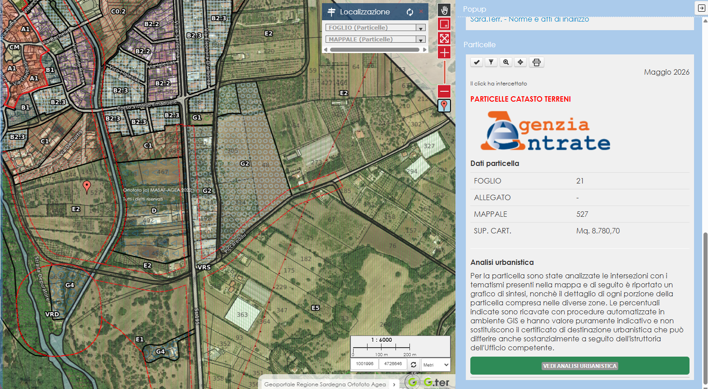
 

### Il popup dell’Analisi urbanistica
Il popup del layer Analisi urbanistica è un elemento particolare, perché la tabella attributi contiene contemporaneamente:
- le informazioni della particella catastale;
- le informazioni della zona urbanistica derivanti dall’intersezione con i layer tematici.

Per questo motivo il popup deve essere costruito come una combinazione strutturata dei due popup precedenti (particelle + tematici), mantenendo coerenza visiva e chiarezza informativa. A differenza degli altri popup, qui è possibile — e consigliabile — descrivere esplicitamente cosa l’utente sta visualizzando, poiché il layer non è destinato alla consultazione diretta ma alla restituzione dei risultati dell’analisi. Struttura consigliata del popup (3 sezioni principali).

#### 1. Sezione – Identificazione della particella
Questa sezione riprende la logica del popup delle particelle, ma in forma sintetica. Può includere:   
Tabella con i dati essenziali:
- FOGLIO
- ALLEGATO
- MAPPALE
  
Questa parte serve a ricordare all’utente quale particella è stata analizzata.

#### 2. Sezione – Informazioni urbanistiche della zona intersecata
Questa sezione riprende la struttura del popup tematico, ma riferita solo alla zona specifica che interseca la particella.   
Può includere:
- TEMA (titolo del tema urbanistico)
- IMGZONA (immagine rappresentativa)
- ZONA e DETTAGLIO
- PERCENTUALE

#### 3. Sezione – Descrizioni e approfondimenti
- descrizioni estese (DESCRIZ_A, DESCRIZ_B, DESCRIZ_C)
- riferimenti normativi (NORME)
- link ai documenti (LINK_X)

Questa sezione è il cuore del popup: restituisce l’informazione urbanistica puntuale relativa alla porzione di particella selezionata.

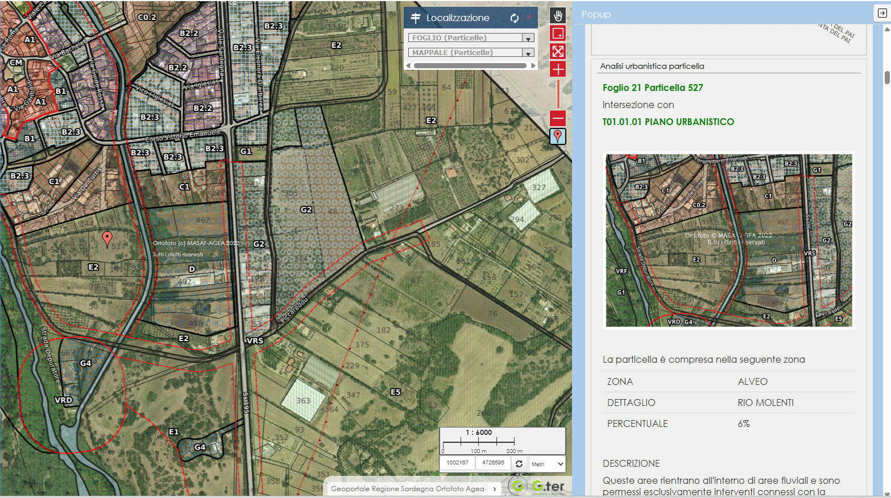
 

### Gestione della tabella attributi
Per rendere i layer selezionabili, filtrabili e intercettabili dal click è necessario pubblicare in Lizmap le relative trabelle degli attributi. Lizmap consente però di decidere se mostrare o meno la tabella degli attributi per ciascun layer selezionabile. Questa scelta è importante sia per la leggibilità dell’interfaccia sia per le prestazioni.
È consigliabile:
- nascondere la tabella attributi per tutti i layer tematici;
- mostrare la tabella attributi solo per il layer Particelle.

Questa configurazione offre diversi vantaggi:
- evita di esporre tabelle molto estese e complesse (tipiche dei tematismi);
- migliora la leggibilità dei dati per l’utente;
- riduce il carico sul browser e sul server;
- mantiene l’interfaccia più pulita e coerente.

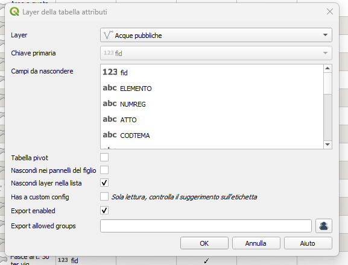
 

### Esclusione del layer Analisi urbanistica
Il layer Analisi urbanistica non deve essere inserito nell’elenco dei layer selezionabili.   
Se venisse incluso:
- anche se invisibile sulla mappa;
- anche se non attivato nel pannello dei layer;

Lizmap aprirebbe comunque il relativo popup al click, generando confusione e rompendo la logica progettuale.
Questo layer, infatti:
- è un layer tecnico;
- non deve essere selezionabile;
- non deve mostrare popup autonomi;
- deve essere consultato solo tramite la relazione con il layer Particelle.

Escluderlo dalla selezione è quindi indispensabile per mantenere coerenza, ordine e prestazioni ottimali.

### Perché questa configurazione è importante
Questa impostazione garantisce:
- un’esperienza utente chiara, con un solo layer catastale principale selezionabile;
- prestazioni migliori, evitando interrogazioni inutili;
- coerenza progettuale, mantenendo il layer Analisi urbanistica come layer di servizio;
- un’interfaccia pulita, senza tabelle o popup non pertinenti.

### Dataviz
Il modulo Dataviz di Lizmap consente di creare piccoli grafici tematici basati sui dati presenti nella mappa. Si tratta di uno strumento leggero ma molto efficace per rendere l’esperienza utente più coinvolgente e intuitiva, soprattutto quando si vogliono rappresentare proporzioni o distribuzioni.
Per mantenere coerenza con l’impostazione progettuale e valorizzare il lavoro svolto sul layer Analisi urbanistica, è consigliabile configurare il Dataviz in modo da mostrare:
- le porzioni urbanistiche che compongono ciascuna particella;
- i valori estratti direttamente dal layer Analisi urbanistica;
- la visualizzazione integrata nel layer padre (Particelle), così da mantenere un flusso informativo chiaro e ordinato.

Questa configurazione permette di:
- mostrare in modo immediato come una particella è suddivisa tra più zone urbanistiche;
- visualizzare graficamente la percentuale di incidenza (PERCENT) di ciascuna zona;
- rendere più comprensibile la complessità dell’analisi urbanistica, soprattutto per utenti non tecnici;
- mantenere la mappa pulita, evitando layer aggiuntivi o simbolizzazioni complesse;
- valorizzare il layer Analisi urbanistica senza mostrarlo direttamente sulla mappa.

Per ottenere un Dataviz efficace e coerente:
- utilizzare come dataset il layer Analisi urbanistica;
- filtrare i dati in base alla particella selezionata (relazione padre → figlio).

Rappresentare le porzioni urbanistiche con un grafico a torta o a barre verticali (consigliato), usando:
- ZONA o DETTAGLIO come etichetta;
- PERCENT come valore numerico;
- integrare il grafico nel popup o nel pannello laterale del layer Particelle.

Questa soluzione mantiene la coerenza del modello informativo e offre all’utente una lettura immediata e intuitiva della composizione urbanistica della particella.

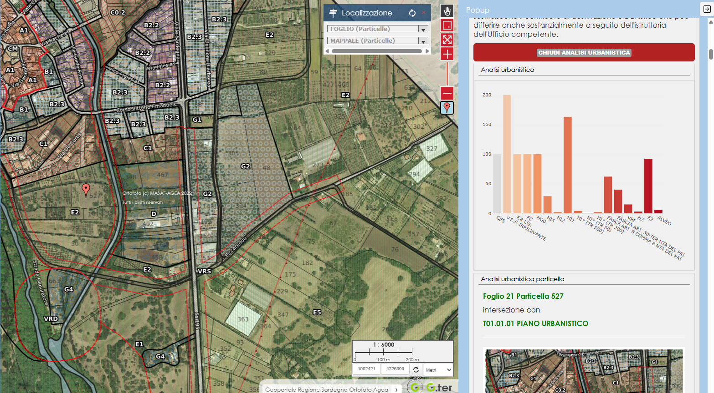
 

### Localizza da layer
Per rendere la mappa realmente funzionale e intuitiva, è indispensabile configurare la localizzazione da layer sul layer Particelle. Questa funzione permette all’utente di individuare una particella inserendo Foglio e Mappale, escludendo la digitalizzazione di valori non validi.   
La configurazione corretta prevede:
- Mappale come primo campo di ricerca;
- Folgio come secondo campo che filtra i Mappali dinamicamente in base al Foglio selezionato.

In questo modo, una volta scelto il Foglio, Lizmap mostrerà solo i mappali realmente presenti in quel Foglio, evitando all’utente errori di digitazione o tentativi frustranti.

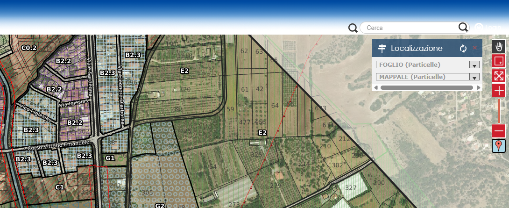
 

## I TOOL AGGIUNTIVI E PERSONALIZZATI
Per incrementare l’efficienza della mappa e migliorare l’esperienza utente, Lizmap è stato esteso con una serie di strumenti personalizzati in JavaScript, progettati per integrare funzionalità non presenti nativamente o per semplificare operazioni ricorrenti.   
I tool implementati sono:
- Tool Street View Apre Google Street View in una nuova finestra del browser, centrata sul punto cliccato sulla mappa. Consente all’utente di contestualizzare rapidamente l’area di interesse.
- Tool di cattura delle coordinate Restituisce le coordinate del punto cliccato, utile per operatori tecnici e per la compilazione di documenti o richieste.
- Tool di deselezione rapida Permette di rimuovere la selezione corrente senza utilizzare lo strumento nativo di Lizmap, rendendo l’interazione più fluida e immediata.
- Tool per la generazione del Certificato di Destinazione Urbanistica (CDU) Alimentato dalla tabella Analisi urbanistica, consente di generare l'anteprima del certificato di destinazione urbanistica in formato .doc.

### Street View   
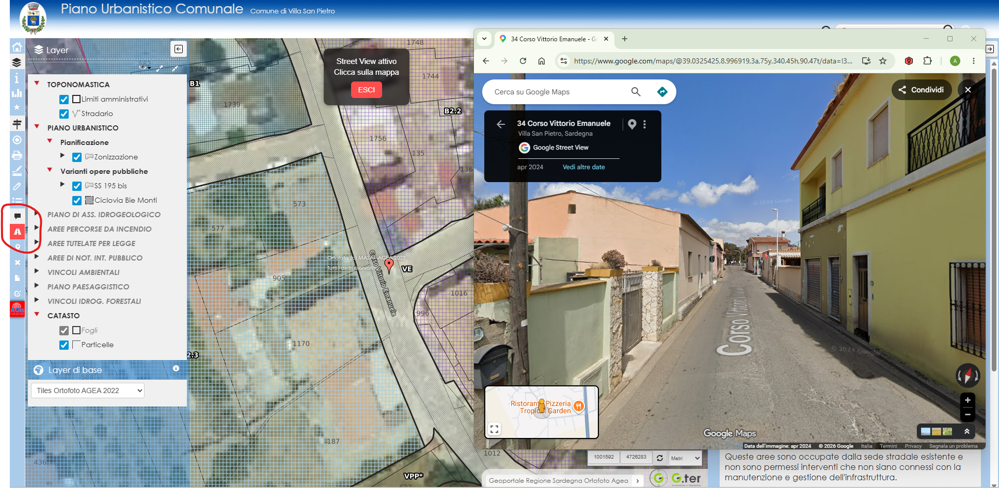
 

### Cattura Coordinate   
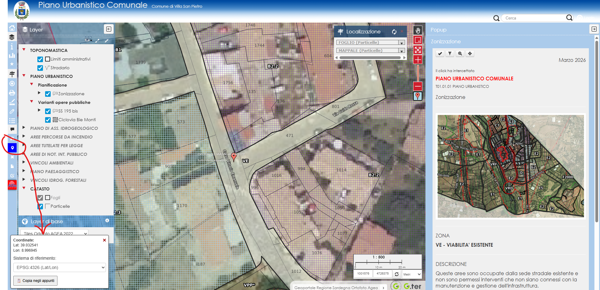
 

### Deselziona rapidamente   
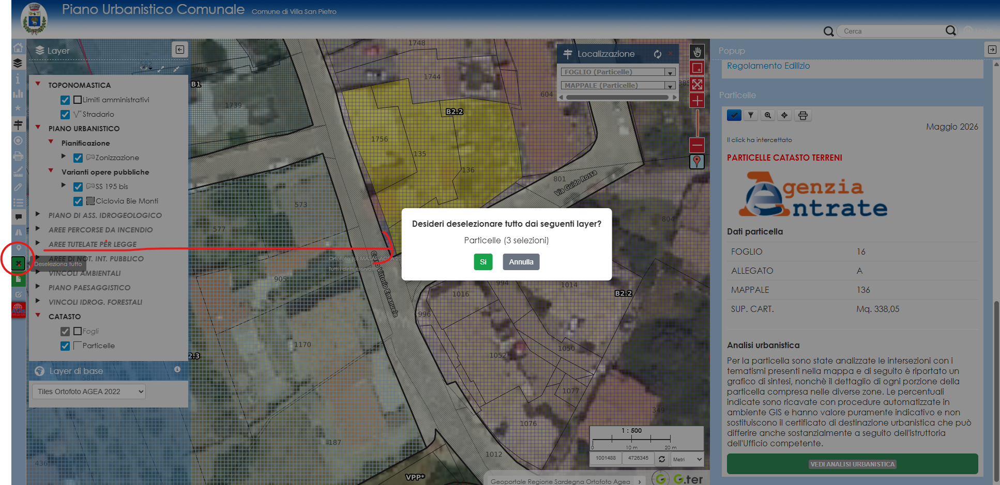
 

### Genera CDU   
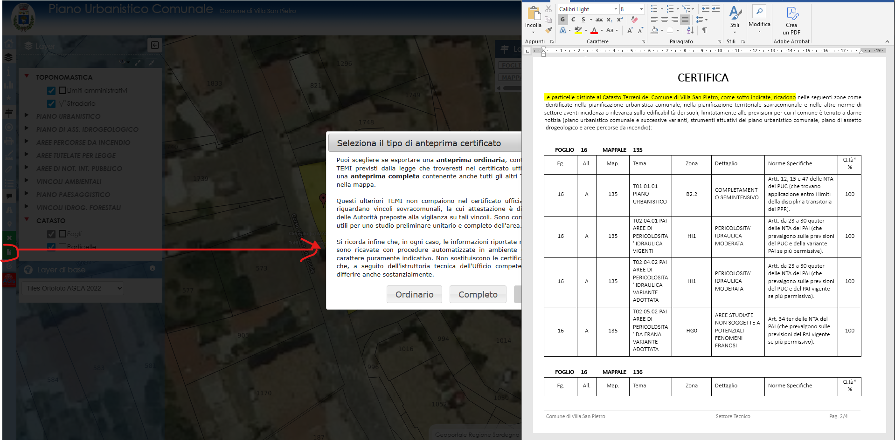
 

## ALCUNI COMMENTI SULLE SCELTE ARCHITETTURALI
La scelta di produrre in locale le intersezioni dell’Analisi urbanistica deriva dalla volontà di mantenere il sistema:
- fluido;
- reattivo;
- scalabile;
- indipendente dal carico del server.

Le intersezioni tra particelle e tematismi sono operazioni computazionalmente pesanti. Eseguirle online, in tempo reale, comporterebbe:
- rallentamenti significativi;
- carico elevato sul server;
- possibili timeout;
- un’esperienza utente poco soddisfacente, soprattutto su mobile.

### Vantaggio principale: prestazioni elevate
Generare le intersezioni offline, tramite uno script Python dedicato, permette di:
- eliminare completamente i calcoli runtime;
- garantire tempi di risposta immediati;
- mantenere la mappa veloce anche con molti utenti simultanei;
- ridurre drasticamente il carico sul server.

Il layer Analisi urbanistica diventa così un layer statico, leggero e immediatamente interrogabile.

### Svantaggio: necessità di aggiornamento periodico
Ogni variazione dei layer:
- catastali (particelle), oppure
- tematici urbanistici,
richiede la rigenerazione della tabella dell’Analisi urbanistica.   
Tuttavia, questo non rappresenta un problema operativo: lo script Python progettato per questo scopo esegue la rigenerazione in modo rapido, deterministico e ripetibile, riducendo l’operazione a pochi minuti.

### Generazione del documento .doc per l’utente
Anche il documento finale (CDU) restituito all’utente non viene generato dinamicamente dal server.
Per preservare prestazioni e stabilità:
- il sistema non costruisce il documento online;
- utilizza un template .doc pre-caricato nella cartella media;
- inserisce nel template solo i dati provenienti dall’interrogazione WFS, basata sulla relazione tra: la particella selezionata, e i relativi record figli del layer Analisi urbanistica.   

Questo approccio garantisce:
- un documento sempre coerente e ben formattato;
- nessun carico aggiuntivo sul server;
- un flusso di generazione semplice, veloce e affidabile.

Perché questa architettura è la più efficace nel nostro contesto:
- Prestazioni massime: nessun calcolo pesante online.
- Stabilità: nessun rischio di blocchi o timeout.
- Controllo totale: lo script Python garantisce risultati ripetibili e auditabili.
- Coerenza: il documento finale è sempre identico nella struttura.
- Scalabilità: anche con molti utenti simultanei, il sistema rimane veloce.
- Manutenzione semplice: la rigenerazione dell’analisi è un’operazione rapida e sicura.

## CONCLUSIONI
Il workflow descritto in questo documento nasce dall’esigenza di costruire un sistema informativo territoriale robusto, performante e facilmente manutenibile, capace di integrare in modo coerente QGIS, QGIS Server e Lizmap. L’esperienza maturata nel Comune di Villa San Pietro ha dimostrato che un approccio metodico, basato su:
- normalizzazione dei dati;
- strutture tabellari stabili;
- intersezioni offline;
- GeoPackage tematici;
- relazioni padre figlio;
- popup strutturati;
- strumenti personalizzati;
- ottimizzazioni mirate in Lizmap;

permette di ottenere un sistema scalabile, veloce e affidabile, utilizzabile quotidianamente sia dagli uffici tecnici sia dai cittadini.
La scelta di spostare offline le operazioni più pesanti (intersezioni, ordinamenti, generazione del CDU) non è un compromesso, ma una precisa strategia architetturale che garantisce:
- prestazioni elevate anche con dataset complessi;
- stabilità del servizio anche con molti utenti simultanei;
- totale controllo sul flusso dei dati;
- ripetibilità e auditabilità dei processi;
- riduzione dei rischi operativi.

Il risultato è un sistema che funziona in modo prevedibile e professionale.   
La modularità introdotta tramite GeoPackage tematici, popup standardizzati, Dataviz, viste, strumenti personalizzati e relazioni QGIS → Lizmap rende il workflow facilmente estendibile a nuovi temi, nuovi layer e nuove esigenze di pubblicazione, senza dover riprogettare l’intero impianto.   
Questo documento rappresenta quindi non solo una guida operativa, ma un modello architetturale per la costruzione di mappe web GIS funzionali e orientate all’utente.

## SCRIPT E AUTOMAZIONI
Di seguito verranno inseriti i collegamenti agli script Python e JavaScript utilizzati nel workflow.

### Script Python

---

<a href="https://github.com/aldogessa/aldogessa.github.io/tree/main/QGIS/Python/CDU" target="_blank">Esegui Intersezioni</a>

---

### Script JavaScript

---

<a href="https://github.com/aldogessa/aldogessa.github.io/tree/main/Lizmap/JS_personalizzati/StreetView" target="_blank">Tool Street View</a>

---

<a href="https://github.com/aldogessa/aldogessa.github.io/tree/main/Lizmap/JS_personalizzati/CopiaCoordinate" target="_blank">Tool Copia coordinate</a>

---

<a href="https://github.com/aldogessa/aldogessa.github.io/tree/main/Lizmap/JS_personalizzati/DeselezionaTuttoVelocemente" target="_blank">Deseleziona rapidamente</a>

---

<a href="https://github.com/aldogessa/aldogessa.github.io/tree/main/Lizmap/JS_personalizzati/CertificatoDestUrbanistica" target="_blank">Genera CDU</a>

---

<a href="https://github.com/aldogessa/aldogessa.github.io/tree/main/Lizmap/JS_personalizzati/Segnaposto" target="_blank">Segnaposto</a>

---

<a href="https://github.com/aldogessa/aldogessa.github.io/tree/main/Lizmap/JS_personalizzati/ControlloPopupFigli" target="_blank">Controllo popup figlio</a>

---

