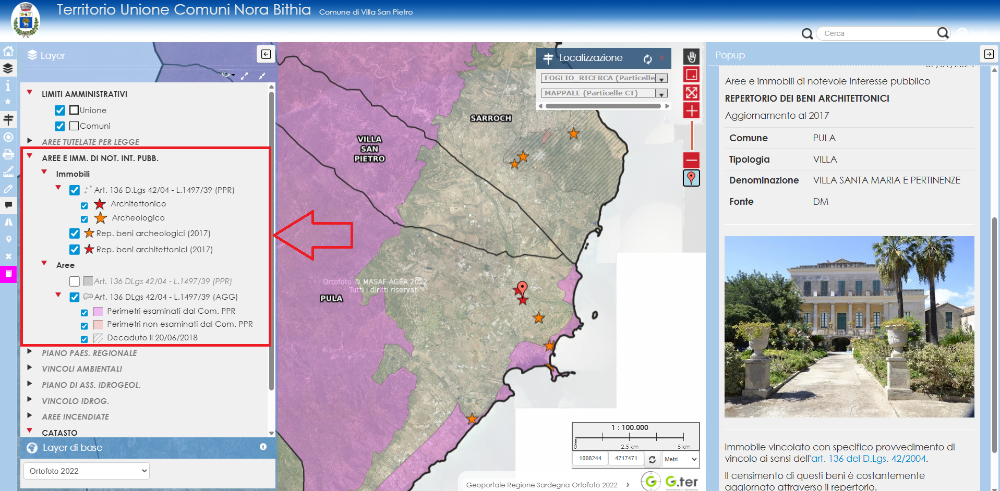
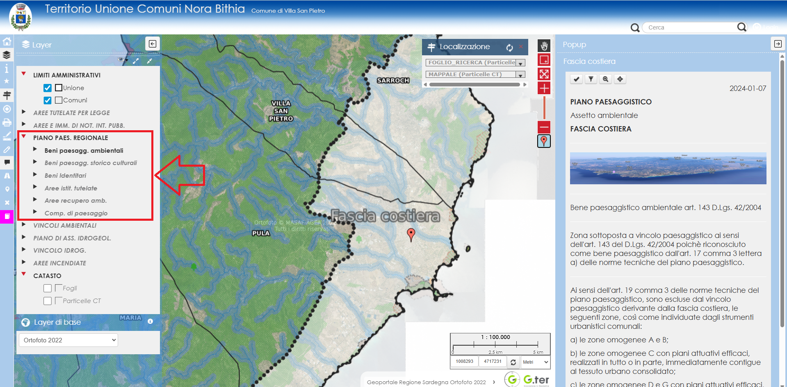
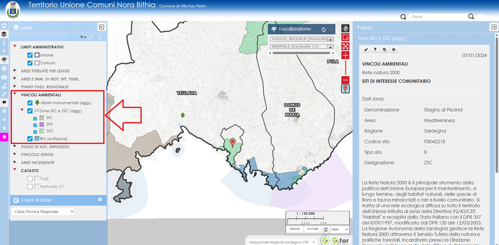
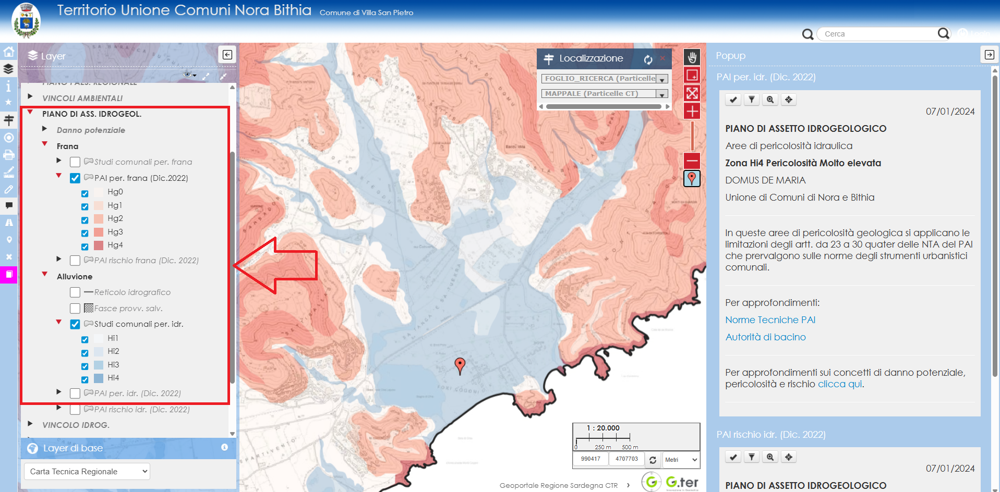
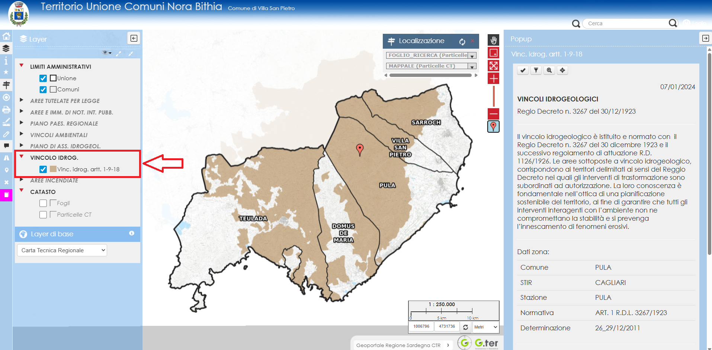
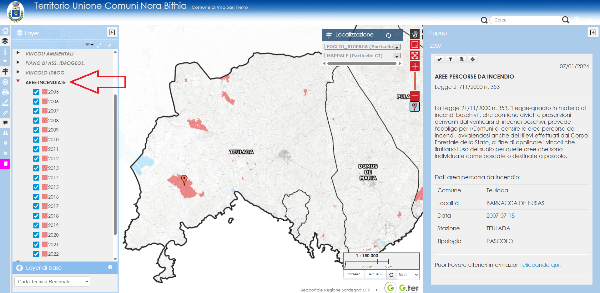

  

  <h1 style="margin:0;">CENNI DI PIANIFICAZIONE E VINCOLI</h1>

## Struttura generale della pianificazione
La pianificazione territoriale segue un preciso ordine gerarchico che impone ai piani sotto ordinati di essere adeguati ai piani sovraordinati, nonché di recepire vincoli, previsioni e prescrizioni che derivano direttamente da norme generali di rango superiore. All’ultimo gradino della catena degli strumenti urbanistici generali c’è il piano urbanistico comunale che, pertanto, deve essere adeguato ai piani sovraordinati e recepire tutte le norme di rango superiore. In caso di contrasto con i piani sovraordinati e le norme di rango superiore, il piano urbanistico deve retrocedere. Al di sotto del piano urbanistico comunale ci sono solo i piani attuativi che danno attuazione, appunto, alle previsioni del piano urbanistico comunale.

## Stratificazione dei vincoli in Sardegna
I vincoli posso essere raggruppati nelle seguenti categorie:

- Vincoli paesaggistici;
- Vincoli ambientali;
- Vincoli idrogeologici;
- Vincoli idrogeologici forestali;
- Aree percorse da incendi.

## Vincoli paesaggistici
I vincoli paesaggistici possono essere suddivisi a loro volta:

- Aree tutelate per legge ai sensi dell’art. 142 del D.Lgs. 42/2004;
- Aree e immobili di notevole interesse pubblico tutelati per espresso provvedimento di vincolo ai sensi dell’art. 136 del D.Lgs. 42/2004;
- Ulteriori aree sottoposte a tutela paesaggistica dal piano paesaggistico regionale ai sensi dell’art. 143 del D.Lgs. 42/2004.

### Aree tutelate per legge

Le aree tutelate per legge sono le aree comunque vincolate a prescindere dalla loro individuazione cartografica, queste aree devono essere riconosciute semplicemente dalla loro descrizione e sono elencate al comma 1 dell’art. 142 del D.Lgs. 42/2004:

- a) I territori costieri compresi in una fascia della profondità di 300 metri dalla linea di battigia, anche per i territori elevati sul mare;
- b) I territori contermini ai laghi compresi in una fascia della profondità di 300 metri dalla linea di battigia, anche per i territori elevati sui laghi;
- c) I fiumi, i torrenti, i corsi d’acqua iscritti negli elenchi previsti dal testo unico delle disposizioni di legge sulle acque ed impianti elettrici, approvato con regio decreto 11 dicembre 1933, n. 1775, e relative sponde o piedi degli argini per una fascia di 150 metri ciascuna;
- d) le montagne per la parte eccedente 1.600 metri sul livello del mare per la catena alpina e 1.200 metri sul livello del mare per la catena appenninica e per le isole;
- e) I ghiacciai e i circhi glaciali;
- f) I parchi e le riserve nazionali o regionali, nonché i territori di protezione esterna dei parchi;
- g) I territori coperti da foreste e da boschi, ancorché percorsi o danneggiati dal fuoco, e quelli sottoposti a vincolo di rimboschimento, come definiti dall’articolo 2, commi 2 e 6, del decreto legislativo 18 maggio 2001, n. 227 (oggi art. 3 e 4 D.Lgs. 34/2018);
- h) le aree assegnate alle università agrarie e le zone gravate da usi civici;
- i) le zone umide incluse nell’elenco previsto dal d.P.R. 13 marzo 1976, n. 448;
- l) i vulcani;
- m) le zone di interesse archeologico.

Ai sensi del comma 2, la disposizione di cui alle precedenti lettere a), b), c), d), e), g), h), l), m), non si applica alle aree che alla data del 6 settembre 1985:

- a) erano delimitate negli strumenti urbanistici, ai sensi del decreto ministeriale 2 aprile 1968, n. 1444, come zone territoriali omogenee A e B;
- b) erano delimitate negli strumenti urbanistici ai sensi del decreto ministeriale 2 aprile 1968, n. 1444, come zone territoriali omogenee diverse dalle zone A e B, limitatamente alle parti di esse ricomprese in piani   pluriennali di attuazione, a condizione che le relative previsioni siano state concretamente realizzate;
- c) nei comuni sprovvisti di tali strumenti, ricadevano nei centri edificati perimetrati ai sensi dell’articolo 18 della legge 22 ottobre 1971, n. 865.

Ai sensi del comma 3, il vincolo sui fiumi (lettera “c” comma 1 art. 142) non si applica ai fiumi che la regione abbia ritenuto in tutto o in parte irrilevanti, includendoli in un apposito elenco reso pubblico e comunicato al Ministero che può confermare o meno la dichiarazione di irrilevanza.

Ai sensi del comma 4, restano inoltre efficace la disciplina derivante dagli atti emessi ai sensi della normativa previgente al D.Lgs. 42/2004:

- a) le dichiarazioni di importante interesse pubblico delle bellezze naturali o panoramiche, notificate in base alla legge 11 giugno 1922, n. 778;
- b) gli elenchi compilati ai sensi della legge 29 giugno 1939, n. 1497;
- c) le dichiarazioni di notevole interesse pubblico notificate ai sensi della legge 29 giugno 1939, n. 1497;
- d) i provvedimenti di riconoscimento delle zone di interesse archeologico emessi ai sensi dell’articolo 82, quinto comma, del d.P.R. 24 luglio 1977, n. 616, aggiunto dall’articolo 1 del decreto-legge 27 giugno 1985, n. 312, convertito con modificazioni nella legge 8 agosto 1985, n. 431;
- d-bis) gli elenchi compilati ovvero integrati ai sensi del decreto legislativo 29 ottobre 1999, n. 490;
- e) le dichiarazioni di notevole interesse pubblico notificate ai sensi del decreto legislativo 29 ottobre 1999, n. 490;
- f) i provvedimenti di riconoscimento delle zone di interesse archeologico emessi ai sensi del decreto legislativo 29 ottobre 1999, n. 490;
- f-bis) i provvedimenti emanati ai sensi dell’articolo 1-ter del decreto-legge 27 giugno 1985, n. 312, convertito, con modificazioni, dalla legge 8 agosto 1985, n. 431.

### Aree e immobili di notevole interesse pubblico tutelati per espresso provvedimento di vincolo art. 136 del D.Lgs. 42/2004

Le aree e gli immobili di notevole interesse pubblico, tutelate per espresso provvedimento di vincolo ai sensi dell’art. 136, sono aree e immobili che, a seguito di un procedimento di valutazione, sono stati perfettamente individuati, cartografati e riconosciuti meritevoli di tutela attraverso un provvedimento amministrativo specifico che indica le caratteristiche del bene e le norme di tutela, possono riguardare le seguenti categorie di beni:

- a) le cose immobili che hanno cospicui caratteri di bellezza naturale, singolarità geologica o memoria storica, ivi compresi gli alberi monumentali;
- b) le ville, i giardini e i parchi, non tutelati dalle disposizioni della Parte seconda del D.Lgs. 42/2004, che si distinguono per la loro non comune bellezza;
- c) i complessi di cose immobili che compongono un caratteristico aspetto avente valore estetico e tradizionale, inclusi i centri ed i nuclei storici;
- d) le bellezze panoramiche e così pure quei punti di vista o di belvedere, accessibili al pubblico, dai quali si goda lo spettacolo di quelle bellezze.

### Ulteriori aree e immobili sottoposti a tutela dal piano paesaggistico regionale

Ai sensi dell’art. 143 del D.Lgs. 42/2004, al piano paesaggistico regionale spetta la ricognizione e l’individuazione delle aree tutelate per legge, delle aree e degli immobili di notevole interesse pubblico, nonché il riconoscimento, l’individuazione e la rappresentazione degli ulteriori beni da sottoporre a vincolo paesaggistico o a determinati criteri di tutela, e dettare le prescrizioni per tali beni.

Il piano paesaggistico regionale suddivide i beni paesaggistici in:

- Beni paesaggistici ambientali;
- Beni Paesaggistici storico-culturali.

Riconosce inoltre:

- I “Beni identitari” che non sono beni paesaggistici, a cui si applica comunque la specifica disciplina di tutela dettata dal piano paesaggistico, anche se non sussiste il vincolo paesaggistico e il relativo obbligo dell’autorizzazione paesaggistica (salvo non ricadano all’interno di altre aree o immobili sottoposti a vincolo paesaggistico);
- Le aree istituzionalmente tutelate a cui si applica la specifica disciplina a prescindere dalla presenza o meno del vincolo paesaggistico (aree SIC, ZPS, Oasi Faunistiche; Parchi etc.);
- Le aree di recupero ambientale, ossia aree degradate dove il piano paesaggistico promuove attività di mitigazione e recupero del degrado (aree industriali, sottoposte a precedenti prelievi di cava etc.), a prescindere dalla presenza o meno del vincolo paesaggistico;
- Le componenti di paesaggio, ossia esegue una ricognizione del territorio regionale qualificando i suoli sulla base del loro stato di utilizzo distinguendo tra aree antropizzate (componente insediativa) e aree non antropizzate (componente ambientale), e dettando per ciascuna componente rilevata gli indirizzi, gli obiettivi e le prescrizioni di piano, a prescindere dalla sussistenza o meno di un vincolo paesaggistico.

## Vincoli ambientali

Appartengono a questa categoria i vincoli che, a prescindere dal vincolo paesaggistico, sono posti a tutela di condizioni ambientali peculiari e dei relativi ecosistemi, suscettibili di essere alterati dall’attività antropica e ove sono previste forme “aggravate” di autorizzazione come la Valutazione di Incidenza e la Valutazione di Impatto Ambientale.

I siti interessati da tali vincoli ambientali sono così classificati:

- Siti di interesse comunitario (SIC);
- Zone di protezione speciale (ZPS);
- Zone di speciale conservazione (ZSC);
- Important Bird Area (IBA avifauna).

Queste aree fanno riferimento alla “Rete Natura 2000” della politica europea per il mantenimento, a lungo termine, degli habitat naturali, delle specie di flora e fauna minacciati o rari a livello comunitario. Per approfondire questo argomento è possibile visitare il sito sito regionale <a href="https://portal.sardegnasira.it/sic-e-zps" target="_blank">cliccando qui</a>.

Fanno parte di questa categoria di beni vincolati anche gli “Alberi Monumentali” che, oltre a essere soggetti a vincolo paesaggistico, sono anche protetti dalla L. 10/2013 e dal DM 24.10.2014.

## Vincoli idrogeologici (PAI)

Il piano di assetto idrogeologico (PAI) regionale ha avviato lo studio delle pericolosità idrauliche (alluvioni) e delle pericolosità geologiche (frane) presenti nel territorio regionale, affidando ai comuni il dettaglio dei propri territori attraverso lo strumento dello studio di compatibilità idraulica, geologica e geotecnica comunale che attiva la variante al PAI, integrandolo e rettificandolo. Nel corso del tempo diversi comuni si sono dotati di propri studi, alcuni sono stati integrati nel PAI, altri sono ancora nel periodo di salvaguardia o in attesa di approvazione. Inizialmente i comuni, per la parte idraulica (pericolo alluvione) avevano la facoltà di selezionare i fiumi con potenziale pericolo idraulico su cui eseguire gli studi e di ignorare i fiumi che venivano ritenuti privi di pericolosità. Con una variante al PAI la Regione ha stabilito che questo approccio non è convincente ed ha istituito una norma di prima salvaguarda (Art. 30-Ter delle NTA del PAI) su tutti i fiumi appartenenti al reticolo idrografico regionale che si applica ai fiumi non studiati con la relativa modellazione della pericolosità. Su questi fiumi si deve applicare una fascia di rispetto variabile, che dipende dalle caratteristiche proprie dell’asta fluviale, in cui, in attesa dello studio, deve applicarsi la normativa prevista per la pericolosità massima HI4.

Dunque i vincoli derivanti dal PAI sono così suddivisibili:

- Aree di pericolosità geologica (da frana);
- Aree di pericolosità idraulica (alluvione);
- Fasce di provvisoria salvaguardia art. 30-Ter delle NTA.
- La classificazione di un area all’interno delle suddette pericolosità fa scattare l’obbligo del rispetto delle rispettive norme e può comportare l’onere della redazione di uno studio di compatibilità idraulica o geologica nei casi espressamente previsti dalle citate NTA del PAI.

Il PAI riconosce anche:

- Il danno potenziale;
- Le aree a rischio frana;
- Le aree a rischio alluvione.

Questa ultima classificazione non ha incidenza sull’attività antropica essendo finalizzata all’individuazione di criteri prioritari per l’esecuzione di interventi di mitigazione del rischio. Per eventuali approfondimenti sul concetto di danno potenziale e rischio è possibile visitare il sito regionale <a href="https://portal.sardegnasira.it/assetto-idrogeologico" target="_blank">cliccando qui</a>.

## Vincoli idrogeologici forestali

Questi vincoli sono più antichi di quelli derivanti dal PAI e attengono a tutele diverse nonostante la somiglianza del nome. Derivano dal RD n. 3267 del 30/12/1923 e sono posti a tutela e difesa del suolo soprattutto nei territori montani, al fine di prevenire l’innescamento di fenomeni erosivi (mentre i vincoli PAI sono posti a protezione delle persone e delle cose). La presenza di questo vincolo impone la necessità di autorizzazione espressa della competente Autorità Forestale per qualunque intervento di trasformazione. L’argomento può essere approfondito sul sito regionale <a href="https://portal.sardegnasira.it/vincolo-idrogeologico" target="_blank">cliccando qui</a>.

## Aree percorse da incendio

Le aree percorse da incendio sono tutelate dalla Legge 353/2000 “Legge quadro in materia di incendi boschi”. Ogni volta che accade un incendio il corpo forestale rileva i territori colpiti e i relativi soprassuoli distinguendoli tra BOSCO, PASCOLO e ALTRO. Sui suoli colpiti da incendi si applicano divieti differenziati in ragione del soprassuolo coinvolto:

- vincoli quindicennali: la destinazione delle zone boscate e dei pascoli i cui soprassuoli siano stati percorsi dal fuoco non può essere modificata rispetto a quella preesistente l’incendio per almeno quindici anni. In tali aree è consentita la realizzazione solamente di opere pubbliche che si rendano necessarie per la salvaguardia della pubblica incolumità e dell’ambiente. Ne consegue l’obbligo di inserire sulle aree predette un vincolo esplicito da trasferire in tutti gli atti di compravendita stipulati entro quindici anni dall’evento;
- vincoli decennali: nelle zone boscate e nei pascoli i cui soprassuoli siano stati percorsi dal fuoco, è vietata per dieci anni la realizzazione di edifici nonché di strutture e infrastrutture finalizzate ad insediamenti civili ed attività produttive, fatti salvi i casi in cui per detta realizzazione siano stati già rilasciati atti autorizzativi comunali in data precedente l’incendio sulla base degli strumenti urbanistici vigenti a tale data. In tali aree è vietato il pascolo e la caccia;
- vincoli quinquennali: sui predetti soprassuoli è vietato lo svolgimento di attività di rimboschimento e di ingegneria ambientale sostenute con risorse finanziarie pubbliche, salvo il caso di specifica autorizzazione concessa o dal Ministro dell’Ambiente, per le aree naturali protette statali, o dalla regione competente, per documentate situazioni di dissesto idrogeologico o per particolari situazioni in cui sia urgente un intervento di tutela su valori ambientali e paesaggistici.

Per approfondimenti è possibile visitare il sito regionale <a href="https://www.sardegnaambiente.it/index.php?xsl=612&s=88121&v=2&c=5186" target="_blank">cliccando qui</a>.

 
