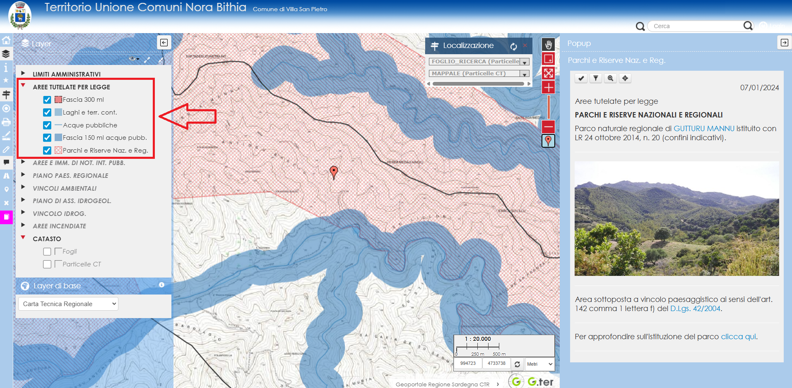

  

  <h1 style="margin:0;">CENNI DI PIANIFICAZIONE E VINCOLI</h1>

## Struttura generale della pianificazione
La pianificazione territoriale segue un preciso ordine gerarchico che impone ai piani sotto ordinati  
di essere adeguati ai piani sovraordinati, nonché di recepire vincoli, previsioni e prescrizioni che  
derivano direttamente da norme generali di rango superiore. All’ultimo gradino della catena degli  
strumenti urbanistici generali c’è il piano urbanistico comunale che, pertanto, deve essere adeguato  
ai piani sovraordinati e recepire tutte le norme di rango superiore. In caso di contrasto con i  
piani sovraordinati e le norme di rango superiore, il piano urbanistico deve essere disapplicato al  
ricorrere di determinate circostanze. Al di sotto del piano urbanistico comunale ci sono solo i piani  
attuativi che danno attuazione, appunto, alle previsioni del piano urbanistico comunale.

## Stratificazione dei vincoli in Sardegna
I vincoli posso essere raggruppati nelle seguenti categorie:

- Vincoli paesaggistici;
- Vincoli ambientali;
- Vincoli idrogeologici;
- Vincoli idrogeologici forestali;
- Aree percorse da incendi.

## Vincoli paesaggistici
I vincoli paesaggistici possono essere suddivisi a loro volta:

- Aree tutelate per legge ai sensi dell’art. 142 del D.Lgs. 42/2004;
- Aree e immobili di notevole interesse pubblico tutelati per espresso  
  provvedimento di vincolo ai sensi dell’art. 136 del D.Lgs. 42/2004;
- Ulteriori aree sottoposte a tutela paesaggistica dal piano paesaggistico  
  regionale ai sensi dell’art. 143 del D.Lgs. 42/2004.

### Aree tutelate per legge

Le aree tutelate per legge sono le aree comunque vincolate a prescindere  
dalla loro individuazione cartografica, queste aree devono essere riconosciute semplicemente  
dalla loro descrizione e sono elencate al comma 1 dell’art. 142 del D.Lgs. 42/2004:

- a) I territori costieri compresi in una fascia della profondità di 300 metri dalla linea di battigia,  
  anche per i territori elevati sul mare;
- b) I territori contermini ai laghi compresi in una fascia della profondità di 300 metri dalla linea  
  di battigia, anche per i territori elevati sui laghi;
- c) I fiumi, i torrenti, i corsi d’acqua iscritti negli elenchi previsti dal testo unico delle disposizioni  
  di legge sulle acque ed impianti elettrici, approvato con regio decreto 11 dicembre 1933, n. 1775, e  
  relative sponde o piedi degli argini per una fascia di 150 metri ciascuna;
- d) le montagne per la parte eccedente 1.600 metri sul livello del mare per la catena alpina e 1.200 metri  
  sul livello del mare per la catena appenninica e per le isole;
- e) I ghiacciai e i circhi glaciali;
- f) I parchi e le riserve nazionali o regionali, nonché i territori di protezione esterna dei parchi;
- g) I territori coperti da foreste e da boschi, ancorché percorsi o danneggiati dal fuoco, e quelli sottoposti  
  a vincolo di rimboschimento, come definiti dall’articolo 2, commi 2 e 6, del  
  decreto legislativo 18 maggio 2001, n. 227 (oggi art. 3 e 4 D.Lgs. 34/2018);
- h) le aree assegnate alle università agrarie e le zone gravate da usi civici;
- i) le zone umide incluse nell’elenco previsto dal d.P.R. 13 marzo 1976, n. 448;
- l) i vulcani;
- m) le zone di interesse archeologico.

Ai sensi del comma 2, la disposizione di cui alle precedenti lettere a), b), c), d), e), g), h), l), m), non  
si applica alle aree che alla data del 6 settembre 1985:

- a) erano delimitate negli strumenti urbanistici, ai sensi del decreto ministeriale 2 aprile 1968, n. 1444, come  
  zone territoriali omogenee A e B;
- b) erano delimitate negli strumenti urbanistici ai sensi del decreto ministeriale 2 aprile 1968, n. 1444, come  
  zone territoriali omogenee diverse dalle zone A e B, limitatamente alle parti di esse ricomprese in piani  
  pluriennali di attuazione, a condizione che le relative previsioni siano state concretamente realizzate;
- c) nei comuni sprovvisti di tali strumenti, ricadevano nei centri edificati perimetrati ai sensi  
  dell’articolo 18 della legge 22 ottobre 1971, n. 865.

Ai sensi del comma 3, il vincolo sui fiumi (lettera “c” comma 1 art. 142) non si applica ai fiumi che la regione abbia  
ritenuto in tutto o in parte irrilevanti, includendoli in un apposito elenco reso pubblico e comunicato al Ministero che  
può confermare o meno la dichiarazione di irrilevanza.

Ai sensi del comma 4, restano inoltre efficace la disciplina derivante dagli atti emessi ai sensi della normativa  
previgente al D.Lgs. 42/2004:

- a) le dichiarazioni di importante interesse pubblico delle bellezze naturali o panoramiche, notificate in base  
  alla legge 11 giugno 1922, n. 778;
- b) gli elenchi compilati ai sensi della legge 29 giugno 1939, n. 1497;
- c) le dichiarazioni di notevole interesse pubblico notificate ai sensi della legge 29 giugno 1939, n. 1497;
- d) i provvedimenti di riconoscimento delle zone di interesse archeologico emessi ai sensi  
  dell’articolo 82, quinto comma, del d.P.R. 24 luglio 1977, n. 616, aggiunto dall’articolo 1 del  
  decreto-legge 27 giugno 1985, n. 312, convertito con modificazioni nella legge 8 agosto 1985, n. 431;
- d-bis) gli elenchi compilati ovvero integrati ai sensi del decreto legislativo 29 ottobre 1999, n. 490;
- e) le dichiarazioni di notevole interesse pubblico notificate ai sensi del decreto legislativo 29 ottobre 1999, n. 490;
- f) i provvedimenti di riconoscimento delle zone di interesse archeologico emessi ai sensi del  
  decreto legislativo 29 ottobre 1999, n. 490;
- f-bis) i provvedimenti emanati ai sensi dell’articolo 1-ter del decreto-legge 27 giugno 1985, n. 312,  
  convertito, con modificazioni, dalla legge 8 agosto 1985, n. 431.
