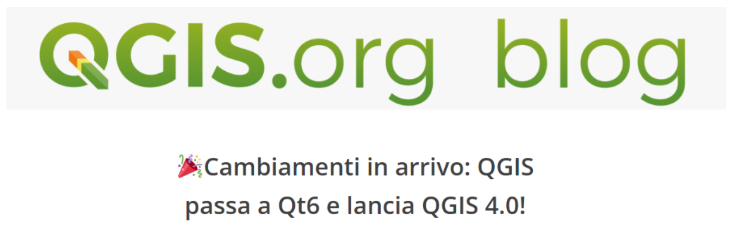
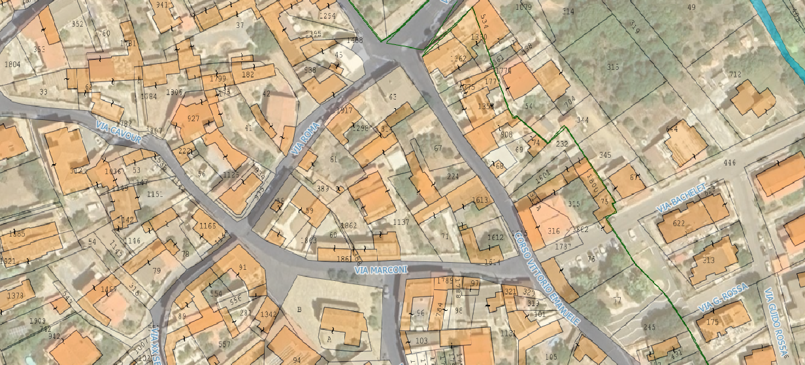

  

  <h1 style="margin:0;">NOVITA'</h1>

---

  

## In arrivo QGIS 4
23/11/2025

Sarà presto disponibile la nuova versione 4.0 di QGIS, i cambiamenti saranno tanti, soprattutto dietro le quinte, sono previsti diversi e importanti cambiamenti nel cuore pulsante di QGIS per aggiornarlo alle più moderne piattaforme. Una prima panoramica sui cambiamenti l’ha fornita Salvatore Fiandaca sul suo canale You Tube:

<a href="https://www.youtube.com/watch?v=IBcH_aVfen0" target="_blank"
   style="
     display:inline-block;
     padding:10px 18px;
     background:#ff0000;
     color:white;
     font-weight:bold;
     border-radius:6px;
     text-decoration:none;
     font-size:16px;
   ">
  ▶️ QGIS4 - Salvatore Fiandaca
</a>

Puoi trovare la notizia ufficiale diffusa dall'organizzazione di QGIS <a href="https://blog.qgis.org/2025/04/17/qgis-is-moving-to-qt6-and-launching-qgis-4-0/" target="_blank">cliccando qui</a>.

---

  

## Catasto sempre più open data
20/11/2025

Il catasto è sempre stato un fortino inespugnabile della burocrazia italiana, ma negli ultimi anni il vento sta cambiando e i dati catastali sono sempre più accessibili a tutti. Paolo Corradeghini ha pubblicato un interessantissimo video, sul suo canale, che spiega le ultimissime novità sull’accessibilità dei dati catastali. In particolare spiega come sia possibile scaricare, dal sito dell’Agenzia delle Entrate, estratti di mappa “vettoriali” in formato DXF adatto per il CAD, e in formato GeoJson adatto per il GIS. In realtà questa possibilità è già disponibile nel “Repertorio Nazionale dei Dati Territoriali” da cui è possibile il download massimo dei dati che però sono aggiornati semestralmente, mentre questo nuovo servizio offre i dati aggiornati al momento della richiesta ma non permette il download massimo, permette però di scaricare, comunque, un numero significativo di fogli, fino a 10 fogli per richiesta.

Qui sotto il video di Paolo Corradeghini:

<a href="https://www.youtube.com/watch?v=W0Pa3EHNMP8" target="_blank"
   style="
     display:inline-block;
     padding:10px 18px;
     background:#ff0000;
     color:white;
     font-weight:bold;
     border-radius:6px;
     text-decoration:none;
     font-size:16px;
   ">
  ▶️ Catasto sempre più open data
</a>

Di seguito i link ai servizi catastali attivi:

<a href="https://www.agenziaentrate.gov.it/portale/schede/fabbricatiterreni/vendita-della-cartografia-catastale/fornitura-dati-cartografici-online-professionisti" target="_blank"
   style="display:inline-block; padding:10px 15px; background:#2c7be5; color:white; border-radius:6px; text-decoration:none;">
 🌍 Nuovo servizio download cartografia vettoriale
</a>

<a href="https://geodati.gov.it/geoportale/visualizzazione-metadati/scheda-metadati/?uuid=age%3AS_0000_ITALIA" target="_blank"
   style="display:inline-block; padding:10px 15px; background:#2c7be5; color:white; border-radius:6px; text-decoration:none;">
 🌍 Repertorio nazionale dati territoriali
</a>

<a href="https://www.agenziaentrate.gov.it/portale/schede/fabbricatiterreni/consultazione-cartografia-catastale/servizio-consultazione-cartografia" target="_blank"
   style="display:inline-block; padding:10px 15px; background:#2c7be5; color:white; border-radius:6px; text-decoration:none;">
 🌍 Servizio WMS Agenzia delle Entrate
</a>

<a href="https://www.agenziaentrate.gov.it/portale/cartografia-catastale-wfs" target="_blank"
   style="display:inline-block; padding:10px 15px; background:#2c7be5; color:white; border-radius:6px; text-decoration:none;">
 🌍 Servizio WFS Agenzia delle Entrate
</a>

**Attenzione** che la cartografia catastale è messa a disposizione del pubblico con alcune limitazioni secondo la licenza **CC-BY 4.0**, qui sotto il link alla licenza:

<a href="https://creativecommons.org/licenses/by/4.0/deed.it" target="_blank"
   style="display:inline-block; padding:10px 15px; background:#2c7be5; color:white; border-radius:6px; text-decoration:none;">
 🌍 Licenza CC-BY 4.0
</a>

  

