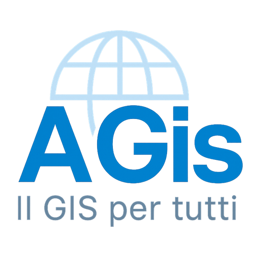
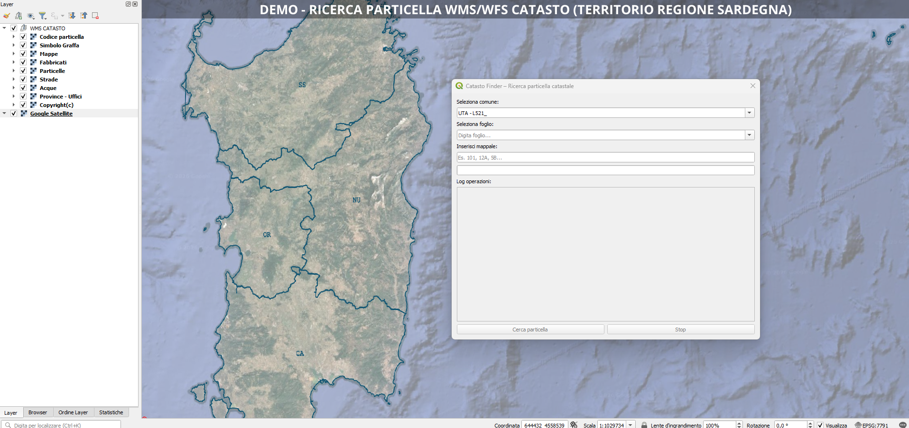
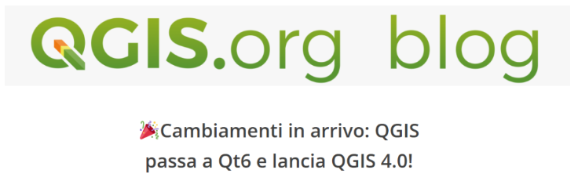
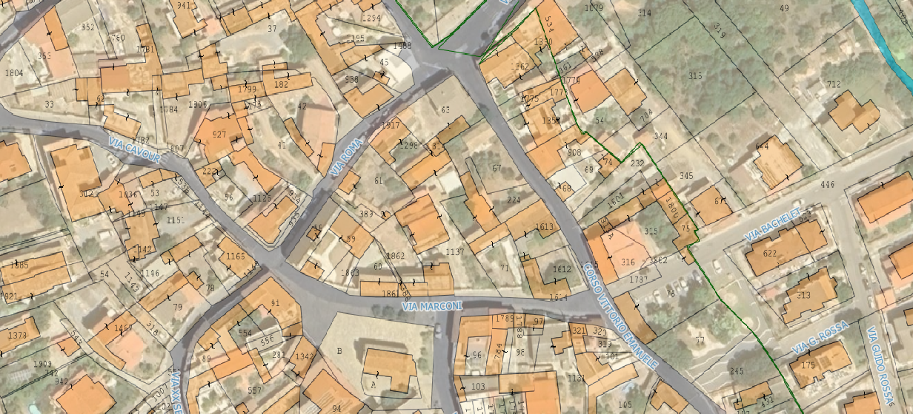

  

  <h1 style="margin:0;">NOVITA'</h1>

---

  

## Ricerca particella catastale via WMS/WFS dell'Agenzia delle Entrate
22/06/2026

L’Agenzia delle Entrate mette a disposizione i servizi WMS e WFS della cartografia catastale, utili rispettivamente per la visualizzazione (WMS) e per il download delle geometrie (WFS). Tuttavia, questi servizi non espongono alcuna funzionalità di ricerca basata sugli attributi catastali: l’unica modalità di interrogazione consentita è quella spaziale, tramite BBOX, con diverse limitazioni sull’estensione massima interrogabile. Partendo da questo vincolo, ho iniziato a sviluppare un plugin QGIS che combina i due servizi per consentire lo zoom diretto su una particella desiderata senza scaricare la geometria dal WFS, cercando di mantenere il processo completamente stand‑alone e leggero. Il plugin è ancora in fase embrionale e attualmente funziona sulla sola Regione Sardegna, ma i primi risultati sembrano incoraggianti.
Di seguito un breve video che mostra il comportamento attuale:

 
<a href="https://www.youtube.com/watch?v=VhnQnJv6PpE" target="_blank"
   style="
     display:inline-block;
     padding:10px 18px;
     background:#ff0000;
     color:white;
     font-weight:bold;
     border-radius:6px;
     text-decoration:none;
     font-size:16px;
   ">
  ▶️ Demo ricerca particella WMS/WFS
</a>

---

  

## Verto online servizio API
11/06/2026

L'istituto Geografico Militare ha rilasciato un nuovo servizio in API che consente di convertire con precisione, gratuitamente e in tempo reale, le coordinate tra i sistemi di riferimento più utilizzati in Italia: Roma40, ED50 ed ETRS89, nelle realizzazioni ETRF89 e ETRF2000, senza essere in possesso dei relativi grigliati di conversione NTV2. Il servizio è molto interessante perchè permette di accedere ai grigliati di conversione senza dover caricare il file sul sito, utilizzando, per esempio direttamente in QGIS, uno script python. Per testare il servizio, con l'assistenza dell'inteligenza artificiale ho progettato uno script di processing che esegue la conversione tra i sistemi di riferimento 3003 <--> 7791 che è molto utile in Sardegna. Il risultato sembra molto affidabile e preciso, ho rilevato scarti, rispetto all'utilizzo di convergo, dell'ordine del millimetro.
Lo script è disponibile nella mia repository al seguente link:
 

<a href="https://github.com/aldogessa/aldogessa.github.io/tree/main/QGIS/Python/Verto_Online" target="_blank">Repository GitHub</a>
 

La documentazione sulle API è reggiungibile al seguente link:
 
<a href="https://igmi.esercito.difesa.it/servizi/verto-online/#:~:text=Verto%20Online%20%C3%A8%20un%20servizio,relativi%20grigliati%20di%20conversione%20NTV2." target="_blank">IGM Verto Online API</a>

---

  

## In arrivo QGIS 4
23/11/2025

Sarà presto disponibile la nuova versione 4.0 di QGIS, i cambiamenti saranno tanti, soprattutto dietro le quinte, sono previsti diversi e importanti cambiamenti nel cuore pulsante di QGIS per aggiornarlo alle più moderne piattaforme. Una prima panoramica sui cambiamenti l’ha fornita Salvatore Fiandaca sul suo canale You Tube:

<a href="https://www.youtube.com/watch?v=IBcH_aVfen0" target="_blank"
   style="
     display:inline-block;
     padding:10px 18px;
     background:#ff0000;
     color:white;
     font-weight:bold;
     border-radius:6px;
     text-decoration:none;
     font-size:16px;
   ">
  ▶️ QGIS4 - Salvatore Fiandaca
</a>

Puoi trovare la notizia ufficiale diffusa dall'organizzazione di QGIS <a href="https://blog.qgis.org/2025/04/17/qgis-is-moving-to-qt6-and-launching-qgis-4-0/" target="_blank">cliccando qui</a>.

---

  

## Catasto sempre più open data
20/11/2025

Il catasto è sempre stato un fortino inespugnabile della burocrazia italiana, ma negli ultimi anni il vento sta cambiando e i dati catastali sono sempre più accessibili a tutti. Paolo Corradeghini ha pubblicato un interessantissimo video, sul suo canale, che spiega le ultimissime novità sull’accessibilità dei dati catastali. In particolare spiega come sia possibile scaricare, dal sito dell’Agenzia delle Entrate, estratti di mappa “vettoriali” in formato DXF adatto per il CAD, e in formato GeoJson adatto per il GIS. In realtà questa possibilità è già disponibile nel “Repertorio Nazionale dei Dati Territoriali” da cui è possibile il download massimo dei dati che però sono aggiornati semestralmente, mentre questo nuovo servizio offre i dati aggiornati al momento della richiesta ma non permette il download massimo, permette però di scaricare, comunque, un numero significativo di fogli, fino a 10 fogli per richiesta.

Qui sotto il video di Paolo Corradeghini:

<a href="https://www.youtube.com/watch?v=W0Pa3EHNMP8" target="_blank"
   style="
     display:inline-block;
     padding:10px 18px;
     background:#ff0000;
     color:white;
     font-weight:bold;
     border-radius:6px;
     text-decoration:none;
     font-size:16px;
   ">
  ▶️ Catasto sempre più open data
</a>

Di seguito i link ai servizi catastali attivi:

<a href="https://www.agenziaentrate.gov.it/portale/schede/fabbricatiterreni/vendita-della-cartografia-catastale/fornitura-dati-cartografici-online-professionisti" target="_blank"
   style="display:inline-block; padding:10px 15px; background:#2c7be5; color:white; border-radius:6px; text-decoration:none;">
 🌍 Nuovo servizio download cartografia vettoriale
</a>

<a href="https://geodati.gov.it/geoportale/visualizzazione-metadati/scheda-metadati/?uuid=age%3AS_0000_ITALIA" target="_blank"
   style="display:inline-block; padding:10px 15px; background:#2c7be5; color:white; border-radius:6px; text-decoration:none;">
 🌍 Repertorio nazionale dati territoriali
</a>

<a href="https://www.agenziaentrate.gov.it/portale/schede/fabbricatiterreni/consultazione-cartografia-catastale/servizio-consultazione-cartografia" target="_blank"
   style="display:inline-block; padding:10px 15px; background:#2c7be5; color:white; border-radius:6px; text-decoration:none;">
 🌍 Servizio WMS Agenzia delle Entrate
</a>

<a href="https://www.agenziaentrate.gov.it/portale/cartografia-catastale-wfs" target="_blank"
   style="display:inline-block; padding:10px 15px; background:#2c7be5; color:white; border-radius:6px; text-decoration:none;">
 🌍 Servizio WFS Agenzia delle Entrate
</a>

**Attenzione** che la cartografia catastale è messa a disposizione del pubblico con alcune limitazioni secondo la licenza **CC-BY 4.0**, qui sotto il link alla licenza:

<a href="https://creativecommons.org/licenses/by/4.0/deed.it" target="_blank"
   style="display:inline-block; padding:10px 15px; background:#2c7be5; color:white; border-radius:6px; text-decoration:none;">
 🌍 Licenza CC-BY 4.0
</a>

  

