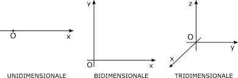

  

  <h1 style="margin:0;">SISTEMI DI RIFERIMENTO</h1>

Paolo Corradeghini ha realizzato un intero percorso didattico sui sistemi di riferimento che rivestono fondamentale importanza in tutti gli ambiti in cui si ha a che fare con la superficie terrestre e la sua rappresentazione. Questo percorso didattico è liberamente fruibili sul suo canale YouTube ed è veramente interessante perché trattato con parole semplici nonostante l’argomento sia complesso e voluminoso. La playlist comprende ben 14 video collegati. Se sei interessato ad approfondire questo affascinante argomento, anche se ti stai approcciando per la prima volta, ti consiglio di andare a vedere il bel lavoro di Paolo Corradeghini.

Qui sotto il link alla playlist:

