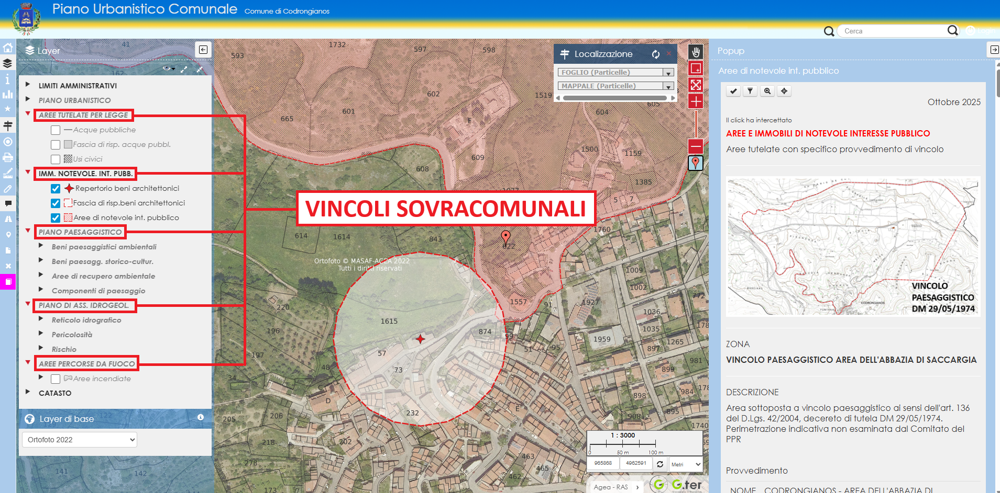

  

  <h1 style="margin:0;">COMUNE DI CODRONGIANOS</h1>

Il Comune di Codrongianos sta realizzando il proprio Sistema Informativo Territoriale (SIT) rendendo accessibili al pubblico i dati territoriali attraverso la pubblicazione di mappe tematiche WebGis che rendono accessibili ai cittadini informazioni di carattere ambientale, urbanistico, territoriale offrendo una navigazione su base cartografica delle stesse. Da questa pagina puoi scaricare e visualizzare il materiale disponibile per l’avvio all’utilizzo delle Mappe WebGis del Comune di Codrongianos, nonché rimanere aggiornato sulle eventuali modifiche.

---

## Le mappe pubblicate
Il Comune ha pubblicato le seguenti mappe:

- Piano Urbanistico Comunale;
- Piano Particolareggiato del Centro Matrice.

#### Piano Urbanistico Comunale
La mappa Web Gis del Piano Urbanistico Comunale oltre a contenere il catasto e la zoonizzazione del PUC, contiene le previsioni e i vincoli della pianificazione sovraordinata:

- Aree tutelate per legge;
- Immobili di notevole interesse pubblico;
- Piano Paesaggistico Regionale;
- Piano di Assetto Idrogeologico;
- Aree percorse da incendio.

La mappa permette diverse interrogazioni e interazioni, ad esempio:

- Ricerca particella catastale;
- Estrazione anteprima certificato di destinazione urbanistica;
- Accesso alle norme del PUC e dei piani sovraordinati (PPR, PAI etc.);
- Disegno;
- Misura;
- Report;
- Stampe.

#### Piano Particolareggiato del Centro Matrice
La mappa Web Gis del Piano Particolareggiato del Centro Matrice permette di individuare le Unità Edilizie (UE) e di accedere alle rispettive Schede e agli altri documenti che riguardano il Piano:

- DCC n. 61/2016;
- Det. Ras. Prot. 23979/2017;
- Relazione;
- Norme tecniche;
- Scheda unità immobiliare;
- Profilo isolato;
- Abaco elementi architettonici;
- Tabelle parametriche.

---

## Tutorial
Le mappe permettono di individuare per ogni particella la relativa destinazione urbanistica, di raggiungere le rispettive norme di utilizzo nonchè di interagire per eseguire analisi urbanistiche di base come misurazioni, importare file esterni per sovrapposizioni, disegnare e stampare. Dalle mappe è inoltre possibile estrapolare report e generare anche una anteprima del certificato di destinazione urbanistica. Per facilitare l'utilizzo delle mappe è stato realizzato un breve manuale e alcuni video tutorial:

<a href="../risorse/documenti/codrongianos_manualewebgis_puc.pdf" download
   style="display:inline-block; padding:10px 15px; background:#2c7be5; color:white; border-radius:6px; text-decoration:none;">
  📄 Scarica il manuale PDF
</a>

#### Mappa del Piano Urbanistico Comunale
Questo video mostra le principali funzionalità della mappa

  <h3 style="margin:0 0 10px 0; font-size:18px; font-weight:600;">
    🎥 PANORAMICA MAPPA WEB GIS DEL PUC
  </h3>

  

    <iframe 
      src="https://www.youtube.com/embed/ubHVhScl8Ic"
      frameborder="0"
      allow="accelerometer; autoplay; clipboard-write; encrypted-media; gyroscope; picture-in-picture"
      allowfullscreen
      style="position:absolute;top:0;left:0;width:100%;height:100%;border-radius:4px;">
    </iframe>
  

  

    🔗 <a href="https://www.youtube.com/watch?v=ubHVhScl8Ic" target="_blank">
      Apri su YouTube
    </a>
  

 

#### Mappa del Piano Particolareggiato del Centro Matrice
Questo video mostra le principali funzionalità della mappa

  <h3 style="margin:0 0 10px 0; font-size:18px; font-weight:600;">
    🎥 CENTRO MATRICE
  </h3>

  

    <iframe 
      src="https://www.youtube.com/embed/kHxI-lpNC0w"
      frameborder="0"
      allow="accelerometer; autoplay; clipboard-write; encrypted-media; gyroscope; picture-in-picture"
      allowfullscreen
      style="position:absolute;top:0;left:0;width:100%;height:100%;border-radius:4px;">
    </iframe>
  

  

    🔗 <a href="https://www.youtube.com/watch?v=kHxI-lpNC0w" target="_blank">
      Apri su YouTube
    </a>
  

 

Le mappe sono in costante aggiornamento in un ottica di continuo miglioramento, nel tempo sono stati aggiunti diversi Tool e diverse mappe. Di seguito alcuni ulteriori tutorial che approfondiscono alcune delle funzionalità più interessanti delle mappe:

#### PUC - Raggruppamento dell'analisi urbanistica della particella
Al fine di rendere più agevole la lettura dei popup, sopratutto quando sono attivi più layer contemporaneamente, l'analisi urbanistica della particella, che contiene il dettaglio delle destinazioni urbanisiche e dei vincoli che la interessano, è stata raggruppata in un contenitore estendibili e collassabile attivando il relativo pulsante. Di default il contenitore è collassato. Di seguito un breve video che mostra come espandere e raggruppare il contenitore dell'analisi urbanistica.

  <h3 style="margin:0 0 10px 0; font-size:18px; font-weight:600;">
    🎥 RAGGRUPPA O RACCHIUDI L'ANALISI URBANISTICA
  </h3>

  

    <iframe 
      src="https://www.youtube.com/embed/ySL47fjnhcc"
      frameborder="0"
      allow="accelerometer; autoplay; clipboard-write; encrypted-media; gyroscope; picture-in-picture"
      allowfullscreen
      style="position:absolute;top:0;left:0;width:100%;height:100%;border-radius:4px;">
    </iframe>
  

  

    🔗 <a href="https://www.youtube.com/watch?v=ySL47fjnhcc" target="_blank">
      Apri su YouTube
    </a>
  

 

#### Tool per catturare le coordinate del punto di click

  <h3 style="margin:0 0 10px 0; font-size:18px; font-weight:600;">
    🎥 TOOL CATTURA COORDINATE
  </h3>

  

    <iframe 
      src="https://www.youtube.com/embed/zfuS4VJMftI"
      frameborder="0"
      allow="accelerometer; autoplay; clipboard-write; encrypted-media; gyroscope; picture-in-picture"
      allowfullscreen
      style="position:absolute;top:0;left:0;width:100%;height:100%;border-radius:4px;">
    </iframe>
  

  

    🔗 <a href="https://www.youtube.com/watch?v=zfuS4VJMftI" target="_blank">
      Apri su YouTube
    </a>
  

 

#### Temi Mappa
Per facilitare la consultazione dei diversi vincoli che interessano un’area specifica di studio, sono stati introdotti i temi mappa che raggruppano i vincoli omogenei con un singolo click per velocizzare la consultazione. Di seguito un piccolo video illustrativo:

  <h3 style="margin:0 0 10px 0; font-size:18px; font-weight:600;">
    🎥 TEMI MAPPA
  </h3>

  

    <iframe 
      src="https://www.youtube.com/embed/eIm76Vc1giE"
      frameborder="0"
      allow="accelerometer; autoplay; clipboard-write; encrypted-media; gyroscope; picture-in-picture"
      allowfullscreen
      style="position:absolute;top:0;left:0;width:100%;height:100%;border-radius:4px;">
    </iframe>
  

  

    🔗 <a href="https://www.youtube.com/watch?v=eIm76Vc1giE" target="_blank">
      Apri su YouTube
    </a>
  

 

#### Tool per l'anteprima del certificato di destinazione urbanistica
Per facilitare l’utilizzo di una delle funzionalità più interessanti della mappa, di seguito un breve video del Tool che permette di estrapolare in pochi click l’anteprima del certificato di destinazione urbanistica di una serie di particelle catastali:

  <h3 style="margin:0 0 10px 0; font-size:18px; font-weight:600;">
    🎥 ANTEPRIMA CERTIFICATO DI DESTINAZIONE URBANISTICA
  </h3>

  

    <iframe 
      src="https://www.youtube.com/embed/vRwDx94im54"
      frameborder="0"
      allow="accelerometer; autoplay; clipboard-write; encrypted-media; gyroscope; picture-in-picture"
      allowfullscreen
      style="position:absolute;top:0;left:0;width:100%;height:100%;border-radius:4px;">
    </iframe>
  

  

    🔗 <a href="https://www.youtube.com/watch?v=vRwDx94im54" target="_blank">
      Apri su YouTube
    </a>
  

 

#### Tool per deselezionare velocemente
Per rendere più intuitivo e veloce deselezionare gli elementi mappa è stato implementato un nuovo Tool che permette di deselezionare tutto, semplicemente cliccando l’apposito bottone sul Dock dei comandi, evitando di avviare il Tool di selezione. Quando un elemento di un layer è selezionato, il bottone diventa verde per attirare l’attenzione dell’utente sulla possibilità di deselezionare tutto velocemente:

  <h3 style="margin:0 0 10px 0; font-size:18px; font-weight:600;">
    🎥 DESELEZIONARE TUTTO VELOCEMENTE
  </h3>

  

    <iframe 
      src="https://www.youtube.com/embed/LJF1PaDt6UI"
      frameborder="0"
      allow="accelerometer; autoplay; clipboard-write; encrypted-media; gyroscope; picture-in-picture"
      allowfullscreen
      style="position:absolute;top:0;left:0;width:100%;height:100%;border-radius:4px;">
    </iframe>
  

  

    🔗 <a href="https://www.youtube.com/watch?v=LJF1PaDt6UI" target="_blank">
      Apri su YouTube
    </a>
  

 

#### Caricare file esterni alla mappa
E' possibile caricare file esterni alle mappe, in formato KML, GPX e GeoJSON, per eseguire delle analisi urbanistiche. Questo video mostra, per esempio, come caricare un percorso turistico in formato KML al fine di analizzare i vincoli insistenti lungo il percorso.

  <h3 style="margin:0 0 10px 0; font-size:18px; font-weight:600;">
    🎥 CARICARE FILE ESTERNI
  </h3>

  

    <iframe 
      src="https://www.youtube.com/embed/2KWACcmdYRs"
      frameborder="0"
      allow="accelerometer; autoplay; clipboard-write; encrypted-media; gyroscope; picture-in-picture"
      allowfullscreen
      style="position:absolute;top:0;left:0;width:100%;height:100%;border-radius:4px;">
    </iframe>
  

  

    🔗 <a href="https://www.youtube.com/watch?v=2KWACcmdYRs" target="_blank">
      Apri su YouTube
    </a>
  

---

## Approfondimenti e News
Di seguito sono documentate le novità che riguardano le mappe, gli aggiornamenti del sistema nonchè ulteriori indicazioni e precisazioni che riguardano l'utilizzo:

#### 12/01/2026 - Aggiornamento a Lizmap 3.9
Nella giornata di Sabato 17 Gennaio 2026 è previsto, salvo imprevisti, l'aggiornamento della piattaforma a Lizmap 3.9. Durante l'aggiornamento potrebbero verificarsi dei disservizi momentanei che dovrebbero risolversi entro il fine settimana.
 

#### 18/12/2025 - Cenni sulla stratificazione dei vincoli in Sardegna

La mappa del PUC rappresenta anche tutti i vincoli insistenti nel territorio comunale e questo può rendere la mappa leggermente più complicata da interpretare. Per utilizzarla al meglio può essere utile conoscere, almeno in linea di principio, come è articolato il sistema vincolistico regionale e cosa questi vincoli rappresentano. Questo argomento è stato trattato in un’apposita pagina raggiungibile <a href="#/agis/cenni_pianificazione" target="_blank">cliccando qui</a>.
 

#### 18/12/2025 - Chiarimenti sulla geolocalizzazione
La geolocalizzazione è attiva, ma sul PC non funzionerà correttamente perché i servizi di geolocalizzazione non sono disponibili sulle work station tradizionali. Il servizio di geolocalizzazione è pensato per i dispositivi mobili, utile in caso di utilizzo della mappa per verifiche sul campo.

 

#### 10/11/2025 - Aggiornamento colori interfaccia

E' stato eseguito l'aggiornamento dei colori dell'interfaccia per richiamare quelli dello stemma comunale, nessuna modifica funzionale.
 

#### 10/11/2025 - Specificazioni sulle mappe di sfondo

Le mappe di sfondo o mappe di base, sono servite da terze parti mediante collegamento WMS, può capitare che in alcuni momenti non siano disponibili in coincidenza delle manutenzioni periodiche dei server. La mappa comunale continua comunque a funzionare. Il disservizio è in genere temporaneo e si risolve nel giro di poco tempo. Le ortofoto, in particolare, sono servite dalla Regione Sardegna e non sono disponibili quando il Geoportale Regionale è in manutenzione. Generalmente è sempre disponibile, invece, OpenStreetMap.

---

## Link

<a href="https://www.comune.codrongianos.ss.it/" target="_blank"
   style="display:inline-block; padding:10px 15px; background:#2c7be5; color:white; border-radius:6px; text-decoration:none;">
 🌍 Sito istituzionale
</a> <a href="https://map.gishosting.eu/?repository=comunecodrongianos" target="_blank"
   style="display:inline-block; padding:10px 15px; background:#2c7be5; color:white; border-radius:6px; text-decoration:none;">
 🌍 Mappe Web GIS
</a>

 
