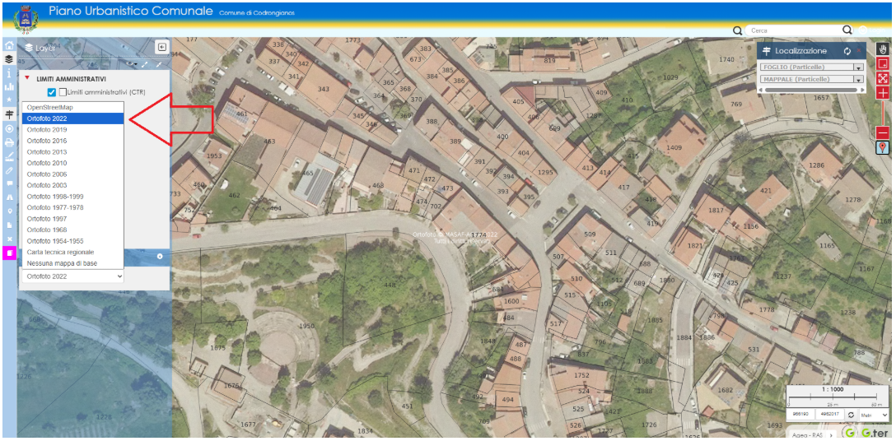

  

  <h1 style="margin:0;">COMUNE DI CODRONGIANOS</h1>

Da questa pagina puoi scaricare e visualizzare il materiale disponibile per l’avvio all’utilizzo delle  
Mappe WebGis autoprodotte del Comune di Codrongianos, nonché rimanere aggiornato sulle eventuali modifiche.
  
## Piano Urbanistico Comunale
---
La mappa Web Gis del Piano Urbanistico Comunale oltre a contenere il catasto e la zoonizzazione del PUC,  
contiene le previsioni e i vincoli della pianificazione sovraordinata:

- Aree tutelate per legge;
- Immobili di notevole interesse pubblico;
- Piano Paesaggistico Regionale;
- Piano di Assetto Idrogeologico;
- Aree percorse da incendio.

La mappa permette diverse interrogazioni e interazioni, ad esempio:

- Ricerca particella catastale;
- Estrazione anteprima certificato di destinazione urbanistica;
- Accesso alle norme del PUC e dei piani sovraordinati (PPR, PAI etc.);
- Disegno;
- Misura;
- Report;
- Stampe.

Il manuale in pdf contenente le istruzioni per l'avvio alle principali funzionalità disponibili nella mappa  
può essere scaricato cliccando sul seguente link:

<a href="../risorse/documenti/codrongianos_manualewebgis_puc.pdf" download
   style="display:inline-block; padding:10px 15px; background:#2c7be5; color:white; border-radius:6px; text-decoration:none;">
  📄 Scarica il manuale PDF
</a>

Qui sotto un video tutorial che mostra concretamente come utilizzare le principali funzionalità della mappa:

  <h3 style="margin:0 0 10px 0; font-size:18px; font-weight:600;">
    🎥 PANORAMICA MAPPA WEB GIS DEL PUC
  </h3>

  

    <iframe 
      src="https://www.youtube.com/embed/ubHVhScl8Ic"
      frameborder="0"
      allow="accelerometer; autoplay; clipboard-write; encrypted-media; gyroscope; picture-in-picture"
      allowfullscreen
      style="position:absolute;top:0;left:0;width:100%;height:100%;border-radius:4px;">
    </iframe>
  

  

    🔗 <a href="https://www.youtube.com/watch?v=ubHVhScl8Ic" target="_blank">
      Apri su YouTube
    </a>
  

  

### Aggiornamenti, approfondimenti, novità:
 

#### 10/11/2025 - Aggiornamento colori interfaccia

E' stato eseguito l'aggiornamento dei colori dell'interfaccia per richiamare quelli dello stemma comunale,  
nessuna modifica funzionale.
  

#### 10/11/2025 - Specificazioni sulle mappe di sfondo

Le mappe di sfondo o mappe di base, sono servite da terze parti mediante collegamento WMS, può capitare  
che in alcuni momenti non siano disponibili in coincidenza delle manutenzioni periodiche dei server.  
La mappa comunale continua comunque a funzionare. Il disservizio è in genere temporaneo e si risolve nel  
giro di poco tempo. Le ortofoto, in particolare, sono servite dalla Regione Sardegna e non sono disponibili  
quando il Geoportale Regionale è in manutenzione. Generalmente è sempre disponibile, invece, OpenStreetMap.
  

#### 20/11/2025 - Tool per catturare le coordinate del punto di click

  <h3 style="margin:0 0 10px 0; font-size:18px; font-weight:600;">
    🎥 TOOL CATTURA COORDINATE
  </h3>

  

    <iframe 
      src="https://www.youtube.com/embed/zfuS4VJMftI"
      frameborder="0"
      allow="accelerometer; autoplay; clipboard-write; encrypted-media; gyroscope; picture-in-picture"
      allowfullscreen
      style="position:absolute;top:0;left:0;width:100%;height:100%;border-radius:4px;">
    </iframe>
  

  

    🔗 <a href="https://www.youtube.com/watch?v=zfuS4VJMftI" target="_blank">
      Apri su YouTube
    </a>
  

 

#### 24/11/2025 - Temi Mappa
Per facilitare la consultazione dei diversi vincoli che interessano un’area specifica di studio, sono stati  
introdotti i temi mappa che raggruppano i vincoli omogenei con un singolo click per velocizzare la consultazione.  
Di seguito un piccolo video illustrativo:

  <h3 style="margin:0 0 10px 0; font-size:18px; font-weight:600;">
    🎥 TEMI MAPPA
  </h3>

  

    <iframe 
      src="https://www.youtube.com/embed/eIm76Vc1giE"
      frameborder="0"
      allow="accelerometer; autoplay; clipboard-write; encrypted-media; gyroscope; picture-in-picture"
      allowfullscreen
      style="position:absolute;top:0;left:0;width:100%;height:100%;border-radius:4px;">
    </iframe>
  

  

    🔗 <a href="https://www.youtube.com/watch?v=eIm76Vc1giE" target="_blank">
      Apri su YouTube
    </a>
  

 

#### 24/11/2025 - Tool per l'anteprima del certificato di destinazione urbanistica
Per facilitare l’utilizzo di una delle funzionalità più interessanti della mappa, di seguito un breve video del  
Tool che permette di estrapolare in pochi click l’anteprima del certificato di destinazione urbanistica di una  
serie di particelle catastali:

  <h3 style="margin:0 0 10px 0; font-size:18px; font-weight:600;">
    🎥 ANTEPRIMA CERTIFICATO DI DESTINAZIONE URBANISTICA
  </h3>

  

    <iframe 
      src="https://www.youtube.com/embed/vRwDx94im54"
      frameborder="0"
      allow="accelerometer; autoplay; clipboard-write; encrypted-media; gyroscope; picture-in-picture"
      allowfullscreen
      style="position:absolute;top:0;left:0;width:100%;height:100%;border-radius:4px;">
    </iframe>
  

  

    🔗 <a href="https://www.youtube.com/watch?v=vRwDx94im54" target="_blank">
      Apri su YouTube
    </a>
  

 

#### 28/11/2025 - Tool per deselezionare velocemente
Per rendere più intuitivo e veloce deselezionare gli elementi mappa è stato implementato un nuovo Tool che  
permette di deselezionare tutto, semplicemente cliccando l’apposito bottone sul Dock dei comandi, evitando di  
avviare il Tool di selezione. Quando un elemento di un layer è selezionato, il bottone diventa verde per  
attirare l’attenzione dell’utente sulla possibilità di deselezionare tutto velocemente:

  <h3 style="margin:0 0 10px 0; font-size:18px; font-weight:600;">
    🎥 DESELEZIONARE TUTTO VELOCEMENTE
  </h3>

  

    <iframe 
      src="https://www.youtube.com/embed/LJF1PaDt6UI"
      frameborder="0"
      allow="accelerometer; autoplay; clipboard-write; encrypted-media; gyroscope; picture-in-picture"
      allowfullscreen
      style="position:absolute;top:0;left:0;width:100%;height:100%;border-radius:4px;">
    </iframe>
  

  

    🔗 <a href="https://www.youtube.com/watch?v=LJF1PaDt6UI" target="_blank">
      Apri su YouTube
    </a>
  

## Piano Centro Matrice
