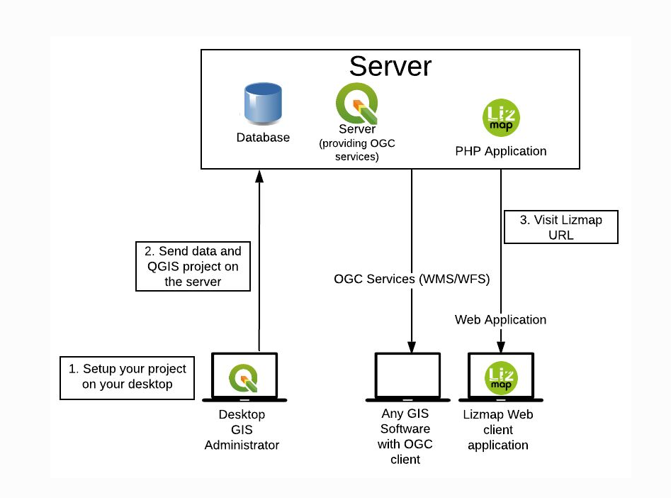

  

  <h1 style="margin:0;">Cosa è Lizmap</h1>

Lizmap è una piattaforma open source che permette di trasformare progetti QGIS in applicazioni WebGIS interattive, rendendo le mappe consultabili da qualsiasi browser. È sviluppata e mantenuta dalla società francese 3Liz, specializzata in soluzioni GIS basate su QGIS.

Lizmap è quindi uno strumento ponte tra QGIS e il web, che democratizza l’accesso alle informazioni geografiche. Grazie a 3Liz e alla comunità open source, rimane aggiornato e integrato con l’ecosistema QGIS, garantendo stabilità e nuove funzionalità nel tempo.

Lizmap per poter pubblicare ha comunque bisogno di un server aperto al pubblico. Gestire un server è molto impegnativo e richiede specifiche competenze, è difficilmente sostenibile per un piccolo comune. Ho scoperto che in Italia la società Gter (Genova) offre un pacchetto chiavi in mano per il servizio di GisHosting basato su Lizmap che permette la pubblicazione autonoma delle mappe, rivolto proprio a chi non dispone di server propri o non è organizzato per la relativa gestione, permettendo a chiunque di pubblicare con relativa facilità le proprie mappe attraverso la loro piattaforma informatica.

I servizi offerti da Gter sono consultabili al seguente link:

<a href="https://gishosting.eu/" target="_blank"
   style="display:inline-block; padding:10px 15px; background:#2c7be5; color:white; border-radius:6px; text-decoration:none;">
 🌍 Il servizio di GisHosting
</a>

Questo servizio permette la pubblicazione autonoma delle mappe QGIS con relativa semplicità e rende concretamente accessibile a chiunque il mondo del WebGis. Un esempio utile a comprendere la tecnologia che ci sta sotto è stato fornito dalla stessa Gter che ha pubblicato diversi video sul punto, uno di questi mostra concretamente la piattaforma e il suo utilizzo:

<a href="https://www.youtube.com/watch?v=cUItxMj9vD8" target="_blank"
   style="display:inline-block; padding:10px 15px; background:#2c7be5; color:white; border-radius:6px; text-decoration:none;">
 🌍 Come utilizzare il servizio di GisHosting
</a>

La documentazione ufficiale di Lizmap, utile all’utilizzo del plugin di QGIS che crea il file di configurazione di Lizmap, da cui dipende la pubblicazione della mappa, è invece disponibile al seguente link:

<a href="https://docs.lizmap.com/current/it/introduction.html#" target="_blank"
   style="display:inline-block; padding:10px 15px; background:#2c7be5; color:white; border-radius:6px; text-decoration:none;">
 🌍 Documentazione Lizmap
</a>

